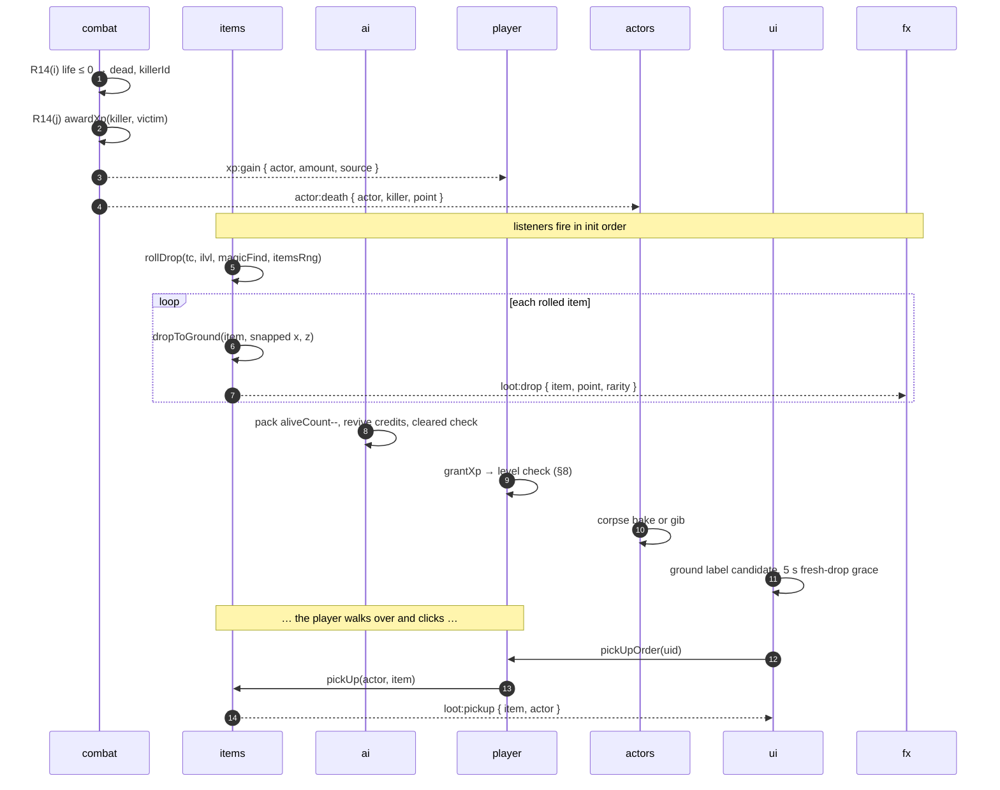

# 11 — Runtime Flows and Sequences

**Claudo II: Lord of Instruction** — the ordered, tick-by-tick sequences that tie
the sixteen subsystems together.

Every other specification describes *what* a system contains. This one describes
*what happens, in what order, across systems*. Where a step names a method it is
a method that exists in `02-api-contracts.md`; where it names an event it is an
event in `ARCHITECTURE.md` or in `02-api-contracts.md` D-8. Anything that does
not yet exist is listed in [§15](#15-additions-requested-to-02-api-contractsmd)
and nowhere else.

**Binding inputs.** `IMPLEMENTATION_PLAN.md`, `ARCHITECTURE.md`,
`01-data-model.md`, `02-api-contracts.md`, `03-combat-math.md`,
`07-world-gen.md`, `08-characters-visual.md` §6, `09-ui.md` §§10–11. Where this
document appears to disagree with one of those, that document wins and this one
is wrong.

---

## Table of contents

0. [Cross-cutting rules every flow obeys](#0-cross-cutting-rules-every-flow-obeys)
1. [Boot](#1-boot)
2. [The frame](#2-the-frame)
3. [Click-to-move](#3-click-to-move)
4. [Basic attack](#4-basic-attack)
5. [Skill cast](#5-skill-cast)
6. [Taking damage](#6-taking-damage)
7. [Death and loot](#7-death-and-loot)
8. [Level up](#8-level-up)
9. [Zone transition](#9-zone-transition)
10. [Town services](#10-town-services)
11. [Save and load](#11-save-and-load)
12. [Pause, focus loss and resize](#12-pause-focus-loss-and-resize)
13. [Error paths](#13-error-paths)
14. [Determinism checkpoints](#14-determinism-checkpoints)
15. [Additions requested to `02-api-contracts.md`](#15-additions-requested-to-02-api-contractsmd)
16. [Deviations and decisions owned by this document](#16-deviations-and-decisions-owned-by-this-document)

---

## 0. Cross-cutting rules every flow obeys

Six rules. They are stated once here and assumed by all fourteen flows. Every
one of them exists because the alternative breaks either determinism or the
frame budget.

### 0.1 The step index is the only clock the simulation may read

`ARCHITECTURE.md` forbids `performance.now()`, `Date.now()` and `dt` inside
`fixedUpdate`, yet `01-data-model.md` schedules almost everything on a
*"simulation step index"* — `attackReady`, `castReady`, `invulnUntil`,
`hitstunUntil`, `expiresStep`, `nextTickStep`, `nextDecisionStep`,
`droppedAtStep`, `expiresAtStep`, `repathAtStep`, `fleeUntilStep`,
`ccImmuneUntil`, `stunChainAt`. Nothing publishes that integer.

**`ctx.time.step`** ([A-1](#a-1--ctxtimestep)) is it: a monotonic `int`,
incremented by the engine immediately before the first `fixedUpdate` of a fixed
step, never reset, never derived from wall clock. Written `now` throughout this
document.

```
seconds → steps :  round(seconds × 60)
steps   → seconds:  steps / 60          (presentation only)
```

`ctx.time.frame` is the **render** frame counter and is not a simulation
quantity. Confusing the two is the bug this rule exists to prevent.

### 0.2 Simulation queues, presentation flushes

`fx`, `ui` and `audio` are `Fixed = N` in their entirety. A subsystem that
learns something during a fixed step — a hit landed, an item dropped, a level
was gained — **must not call them from there.** It writes a record into a
preallocated intent ring and drains that ring in `update()` (for `fx`, `audio`,
`player`) or `lateUpdate()` (for `ui`).

| Producer | Ring | Capacity | Drained in |
|---|---|---|---|
| `combat` → `fx` / `audio` | `hitFeedback` | 128 | `fx.update`, `audio.update` |
| `combat` / `player` → `ui` | `uiFeedback` | 128 | `ui.lateUpdate` |
| `skills` → `fx` | `castFeedback` | 64 | `fx.update` |
| `items` → `fx` / `ui` | `lootFeedback` | 64 | `fx.update`, `ui.lateUpdate` |
| `player` → `ui` | `playerFeedback` | 32 | `ui.lateUpdate` |

A ring that overflows **drops the oldest cosmetic entry and never grows**
(`01-data-model.md` §11). Because the rings are drained once per rendered frame
and a frame may contain up to six fixed steps ([§12](#12-pause-focus-loss-and-resize)),
a burst of six steps' worth of feedback collapses into one frame of
presentation. That is correct: it is what the damage-number coalescing rule of
`09-ui.md` §10.1 already assumes.

The reverse direction is symmetric. `player` cannot call `ui.toast()` from
`fixedUpdate`, so a refused order writes a **feedback code** which
`player.update()` turns into a `ui` call:

| Code | `update()` does |
|---|---|
| `unreachable` | `ui.toast(t('order.unreachable'),'warn')`, `audio.playUi('ui.error')` |
| `no_resource` | `ui.floatingText(px,py,pz,t('combat.noMana'),'#6a7bff')`, `audio.playUi('ui.error')` |
| `cooldown` | `audio.playUi('ui.error')` only — no text; cooldown is already on the hotbar |
| `inventory_full` | `ui.toast(t('inventory.full'),'warn')`, `audio.playUi('ui.error')` |
| `out_of_range` | silent; the order became a move order instead |
| `requirements` | `ui.toast(t('item.requirements'),'warn')` |

### 0.3 Listener order is init order, and it is contractual

`EventBus.on()` appends; `emit()` dispatches synchronously in registration
order. Every subsystem registers its listeners in `init()`, and `init()` runs in
the topological order of `02-api-contracts.md`:

```
render → materials → sky → physics → world → nav → actors → combat
       → fx → skills → items → ai → player → ui → audio → save
```

Therefore the listeners of any event fire in exactly that order, every run. Two
consequences that flows depend on:

- On `actor:death`, `items` (11) rolls the treasure class **before** `ai` (12)
  does its pack bookkeeping and **before** `ui` (14) draws anything, so a label
  can never appear for an item that has not been rolled.
- On `zone:ready`, `physics` (4) confirms its grid before `nav` (6) is asked
  anything, and `ai` (12) spawns after both.

A handler that throws is caught and logged by the bus and does not stop the
others (`02-api-contracts.md`, Event discipline). **A silently swallowed
exception is therefore possible in every flow below**, and "the event did not
fire" is never the first hypothesis — the console is.

### 0.4 Damage is requested, never applied

Restated because eleven of the fourteen flows touch it. `skills` and `ai` build
a packet with `combat.buildAttackPacket()` / `buildSpellPacket()`, adjust only
the caller-adjustable fields (`radius` consumers, `pierceIndex`, `onHitStatus`,
`knockback`, `originX/Y/Z`), and emit `combat:hit-request`. `combat` is the only
system that calls `resolve()` and the only emitter of `actor:damage`,
`actor:death`, `actor:heal`, `actor:status` and `xp:gain`.

### 0.5 Stat recomputation is lazy and lands one step later

`stats:dirty` sets `actor.statsDirty`. `actors.fixedUpdate` recomposes at
sub-step **A2**, at the top of the step, before anything reads `actor.stats`.
Anything that emits `stats:dirty` *after* A2 in step *N* is therefore visible at
A2 of step *N + 1*, one step (16.7 ms) later. Every flow that depends on the
delay says so explicitly; every flow that does not is unaffected by it.

### 0.6 Pooled payloads are valid for one step only

`DamagePacket` and `DamageResult` are pooled and released by `combat` at the
**top of its next fixed pass** (sub-step C1), which is after every producer in
step *N* has finished and before any producer in step *N + 1* has started. This
satisfies `01-data-model.md` §11.2's "released at end of step" without needing
an engine-level step epilogue. Every listener copies what it needs during the
synchronous dispatch and holds nothing.

---

## 1. Boot

Page load to a playable frame. Two clocks, because the boot is interrupted by a
decision the player has to make:

- **T<sub>menu</sub>** — navigation to the first rendered, interactive frame
  (the main menu over the `menu_void` sky).
- **T<sub>play</sub>** — the player's commit at the menu to `setControlEnabled(true)`
  in Last Bastion.

### 1.1 Sequence

```mermaid
sequenceDiagram
    autonumber
    participant B as browser
    participant M as main.js
    participant E as engine
    participant R as registry
    participant S as 16 subsystems
    participant P as prewarm
    participant U as ui
    participant SV as save
    participant W as world
    participant PL as player
    participant H as capture harness

    B->>M: module graph evaluated
    M->>M: createConfig({quality, deterministic})
    M->>E: new Engine({canvas, config})
    M->>R: add() × 16  (order irrelevant)
    M->>U: (deferred — ui not yet inited)
    M->>E: await engine.init()
    E->>R: resolve()  → topological order
    loop each subsystem, in order
        E->>S: await init(ctx)
        S->>S: ctx.rng.fork() exactly once
        S->>S: allocate pools, build data tables
    end
    E->>E: input.attach(); resize()
    M->>U: ui.setScreen('boot')
    M->>P: await prewarm(engine)
    P->>S: prewarmMaterials(ctx) — render first, fx excluded
    M->>E: engine.start()
    E-->>B: frame 1 rendered (boot veil)
    Note over S: fx self-warms on frame 2
    M->>SV: save.meta()
    alt a slot exists
        M->>U: setScreen('main_menu')
    else no slot
        M->>U: setScreen('character_create')
    end
    E-->>H: __READY__ = true at BOOT_FRAMES = 3
    Note over B,H: ——— T_menu ———
    U->>PL: createCharacter() | loadCharacter(save)
    PL->>W: world.requestZone('last_bastion','town_spawn',…)
    W->>W: town instance already resident → skip T3–T9
    W-->>S: zone:ready
    PL->>PL: player spawns, stats compose
    E-->>B: prime frame (still black)
    U->>PL: fade in 350 ms → setControlEnabled(true)
    Note over B,H: ——— T_play ———
```

### 1.2 Stage table

| # | Stage | Owner | What happens | Budget (ms) | Σ (ms) |
|---:|---|---|---|---:|---:|
| **B1** | Document + module graph | browser | `index.html`, the Vite ESM bundle, `three` evaluated | 180 | 180 |
| **B2** | Config | `main.js` | `createConfig({ quality: params.q ?? 'high', deterministic: capture })`. Reads `?q`, `?capture`, `?lockstep`, `?prewarm`, `?seed`. Builds `config.q` — `shadowMapSize`, `particleBudget`, `decalBudget`, `maxActors`, `groundItemBudget`, `corpseBudget`, `audio` | 4 | 184 |
| **B3** | Engine construction | `main.js` | `new Engine({ canvas, config })` — `scene`, `camera` (FOV 35, pitch `config.camPitch` 52°, distance `config.camDist` 22), `uiScene`, `uiCamera`, `EventBus`, `Input`, root `Rng`, `time` | 6 | 190 |
| **B4** | Registration | `main.js` | `engine.add()` × 16. Order is irrelevant; `Registry.resolve()` topo-sorts on `static deps` and throws on a cycle or a missing dep | 2 | 192 |
| **B5** | Topological init | `engine` | [§1.3](#13-the-init-budget) | 2 218 | 2 410 |
| **B6** | Input + resize | `engine` | `input.attach()`, `resize()` → `resize` event to every subsystem that implements it | 4 | 2 414 |
| **B7** | Boot veil | `ui` | `ui.setScreen('boot')` — a full-screen `--ash-950` plate, no spinner, no text. It exists only so the first composited frame is not a white flash | 3 | 2 417 |
| **B8** | Shader pre-warm | `core/prewarm.js` | [§1.4](#14-pre-warm) | 640 | 3 057 |
| **B9** | `engine.start()` | `engine` | `requestAnimationFrame` loop begins. Frame 1 renders the boot veil over `menu_void` | 38 | 3 095 |
| **B10** | `fx` self-warm | `fx` | `fx.prewarmMaterials` runs on frame 2, deliberately excluded from B8: its program cache key carries the **visible** light count, which is only settled after `render`'s first cull and `world`'s ballast stabilisation | 95 | 3 190 |
| **B11** | Save probe | `save` | `save.meta()`; `save.settings()` → `ui.setLanguage`, `render.setQuality`, `audio.setBusVolume` | 8 | 3 198 |
| **B12** | Menu | `ui` | `setScreen('main_menu')` if any slot exists, else `setScreen('character_create')`. `ui` renders the class paperdolls into `ctx.uiScene` | 22 | 3 220 |
| **B13** | Harness handshake | `main.js` | `BOOT_FRAMES = 3` frames pumped (lockstep) or awaited (`rAF`), then `window.__READY__ = true`, `window.__ENGINE__ = engine`, `window.__PREWARM__ = warmup` | 34 | **3 254** |

**T<sub>menu</sub> = 3 254 ms. Target ≤ 4 500 ms. Hard fail 8 000 ms**, at which
point `main.js` logs the per-stage breakdown and still boots.

The frame count, not a `rAF` race, is what raises `__READY__`. In lockstep mode
the engine schedules no frames of its own and `shotApi.pump(3)` advances exactly
three, so a named shot is always applied at engine frame 3 no matter how long
boot took in wall-clock terms. This is the single change that made the pixel
gate immune to pre-warm duration in the reference project and it is ported
verbatim.

### 1.3 The init budget

`Registry.resolve()` produces this order; every subsystem takes **exactly one**
`ctx.rng.fork()` here and never again, so the fork sequence is itself
deterministic ([§14](#14-determinism-checkpoints)).

| # | id | ms | What `init()` does |
|---:|---|---:|---|
| 1 | `render` | 210 | WebGL2 context, HDR render targets at `screenSize`, 2–3 shadow cascades at `q.shadowMapSize`, depth/normal prepass MRT, GTAO + bloom + AgX + SMAA chain, procedural grade LUT, 12 ballast light slots parked at `intensity 0, visible true` |
| 2 | `materials` | 620 | The GPU texture forge. 12 surface sets (`stone` … `crystal`) at 3 octaves, the three character array textures (3 × 6 × 256², **220 ms**, owned here and consumed by `actors`), value/gradient/Worley/blue noise banks, Sobel height→normal, the icon and decal atlases |
| 3 | `sky` | 240 | Analytic scattering into a cube target and a PMREM chain for each of the five presets (`bastion_night`, `wastes_dusk`, `bonereach_interior`, `altar_ember`, `menu_void`). Fixed per zone, never animated |
| 4 | `physics` | 3 | 2 m uniform grid arenas, body arrays sized `q.maxActors`, the 32-deep `Hit`/`MoveResult` rings |
| 5 | `world` | 260 | Tile-kit prototypes and the nine instancing groups (110 ms), then **the whole of Last Bastion** — layout, geometry, 310 footprints into `physics`, `nav.rebuild` at 0.54 ms (150 ms). The town instance is built once here and never disposed (`07-world-gen.md` §10.4) |
| 6 | `nav` | 6 | A* open/closed arenas, the 64-request `PathRequest` pool, the 64 × 256 `PathNode` arena, the flow-field buffers |
| 7 | `actors` | 663 | Four rigs (3 ms), 10 archetypes × 2 LODs of geometry (380 ms), skin binding + joint clamp + Laplacian smoothing + seam weld (145 ms), occluder AO and grime/wear vertex bake (95 ms), two faction `BatchedMesh`es (15 ms), 4 material templates + 48 instances (25 ms). Takes a dedicated `geoRng = rng.fork()` **before** pre-warm so geometry never shifts the gameplay streams |
| 8 | `combat` | 2 | 256 `DamagePacket`, 256 `DamageResult`, 1024 `StatusEffectInstance`, the element and status tables |
| 9 | `fx` | 90 | Particle simulation textures at `q.particleBudget`, the decal ring at `q.decalBudget`, trail pool, the 12 shared light slots, every FX preset record |
| 10 | `skills` | 6 | The 30 `SkillDefinition`s and the six trees, the projectile pool at `q` size, 24–64 ground effects, buff instances, cooldown maps |
| 11 | `items` | 58 | Bases, affixes, uniques and treasure classes; the 10×4 / 10×8 / ×4 container arrays; the icon `OffscreenCanvas` pool |
| 12 | `ai` | 8 | The bestiary (six archetypes + Molgrim), the nine monster affixes, the `Brain` pool at `q.maxActors` |
| 13 | `player` | 4 | Intent record, camera rig, hotbar, quest table |
| 14 | `ui` | 40 | The `#ui` DOM tree, the injected stylesheet, both i18n dictionaries, the minimap canvas, the `#cl2-fx` damage-number canvas, the 48-node ground-label pool |
| 15 | `audio` | 3 | The `AudioContext` only, suspended. The 444-node graph, the 3.69 MB noise bank, the IR and the round-robin tables are **deferred to the first user gesture** — 40 ms behind the class-select screen, off the boot critical path (`10-audio.md` §8.3) |
| 16 | `save` | 5 | Reads `claudo2.save.v1.meta`, probes the three slots, registers the five autosave listeners |
| | **total** | **2 218** | budget **2 600**, hard fail **5 000** |

Any subsystem whose `init()` exceeds 50 ms logs its own timing, which is how a
regression in the 620 ms materials forge or the 663 ms actors bake is
attributable rather than merely visible.

### 1.4 Pre-warm

`src/core/prewarm.js` runs after `init()` and before `engine.start()`. It binds
a 1×1 scratch render target first, because `outputColorSpace` and `toneMapping`
are part of Three's program cache key and are read off the **currently bound**
target — compiling against the canvas produces the `srgb` + tone-mapped variant
that the game, which draws into HDR targets, never uses.

| Order | Hook | ms | Compiles |
|---:|---|---:|---|
| 1 | `render.prewarmMaterials({ post: true, shadow: false })` | 190 | The CSM depth pass, the MRT prepass and the ~13 full-screen post materials, blitted into a 4×4 scratch. **Runs first**, because it patches every lit material with the CSM/AO injection and a program compiled off an unpatched material is discarded by the first real frame |
| 2 | `materials.prewarmMaterials` | 40 | The shared library's plain / triplanar / detail variants |
| 3 | `sky.prewarmMaterials` | 30 | Dome and fog programs for all five presets |
| 4 | `world.prewarmMaterials` | 120 | Nine group materials × {plain, instanced, instanced+instanceColor} × {forward, CSM-depth, prepass}, the four ground palettes, the ridge/berm/silhouette and portal materials |
| 5 | `actors.prewarmMaterials` | 200 | Exactly **4** programs — skinned-world, skinned-UI, batched-world, depth — against a 2-triangle stand-in carrying the exact character attribute set (`position, normal, uv, color, aSurf, skinIndex, skinWeight`) bound to a real 24-bone skeleton. A stand-in missing `aSurf` compiles a different program and the pre-warm is worthless |
| 6 | `items.prewarmMaterials` | 25 | The icon atlas material and the ground-item instanced material |
| 7 | `skills.prewarmMaterials` | 35 | Projectile, beam and ground-effect materials for all five elements |
| — | `fx` | (95, frame 2) | **Excluded here on purpose** — see B10 |
| | **total** | **640** | budget **900**, hard fail **2 000** |

Three invariants, all learned expensively by the reference project and all
restated in `08-characters-visual.md` §10.3:

1. **A render target must be bound while compiling.**
2. **Nothing here may draw from `ctx.rng`.** Consuming the stream shifts every
   downstream draw and changes the picture, which breaks `imagediff`.
   `prewarm()` snapshots and restores `engine.rng`'s four words, `engine.time`
   and `engine._accum` in a `finally` regardless.
3. **Nothing here may read the clock.** A subsystem that animates off
   `performance.now()` makes boot duration observable in the output, and after
   that no pre-warm change can ever be proven pixel-neutral.

Pre-warm is idempotent and never throws; a failure degrades to the old stutter
and must not prevent boot. **Acceptance gate:**
`renderer.info.programs.length` recorded at the end of pre-warm is asserted
unchanged after a full `playtest.mjs` run including a boss kill, four champion
spawns, two unique spawns, sixteen corpses and a full equipment swap.
**Target: 0 shader compiles during play.**

### 1.5 Character creation versus save load

Both paths end at the same place. Neither is on the T<sub>menu</sub> clock —
they start when the player commits.

| Step | New character | Loaded character |
|---:|---|---|
| 1 | `ui` collects `classId` and a name matching `[A-Za-z][A-Za-z0-9 '-]{0,15}` | `ui` shows the three slots from `save.meta().slots` |
| 2 | `worldSeed = (config.deterministic ? 0x5eed1234 : rng.u32())` — the **only** non-deterministic draw in the game, taken once and then written to the save | `save.load(slot)` → validate (15 invariants) → migrate → `{ ok, save, error, migratedFrom }` |
| 3 | `player.createCharacter(classId, name, worldSeed)` — 12 ms | `player.loadCharacter(save)` — 14 ms |
| 4 | `items.createItem()` per `ClassArchetype.startingItems`, `items.equip()` in `SLOT_ORDER` | `items.rebuildCache(item)` for every item in equipment + inventory + belt + stash — 12 ms at a full inventory |
| 5 | `world.setWorldSeed(worldSeed)` | `world.setWorldSeed(save.worldSeed)` |
| 6 | `skills.allocate()` for nothing; hotbar slot 1 gets the class's tier-1 attack | hotbar restored from `save.hotbar` |
| 7 | `stats:dirty` → composed at A2 of the first fixed step | same |
| 8 | `currentZone = 'last_bastion'` | `currentZone = save.currentZone`, falling back to `last_bastion` on invariant 15 |

### 1.6 First zone and player spawn

`player` calls `world.requestZone(zoneId, entryTag, { runIndex, difficulty })`
([A-2](#a-2--worldrequestzone)); the engine services it between `lateUpdate` and
`render`. For `last_bastion` the instance is already resident from B5, so stages
T3–T9 of [§9](#9-zone-transition) are skipped entirely and only T10–T15 run:

| Stage | ms |
|---|---:|
| T10 spawn plan (town: NPCs, stash, portal pad — no packs) | 3 |
| T11 `world.entry('town_spawn')` → `actors.teleport(player, x, z)`, `facing` from the entry record | < 1 |
| T12 `zone:ready { zoneId, bounds, navVersion }` | 6 |
| T13 restore (nothing on a fresh boot) | 0 |
| T14 prime frame — one `fixedUpdate`, one full `render`, still behind the veil | 34 |
| T15 fade in 350 ms, then `player.setControlEnabled(true)` | 350 |
| **T<sub>play</sub>** | **≈ 394** |

Entering a **field** zone directly (a loaded save whose `currentZone` is
`ashen_wastes`) runs the full T1–T15 and costs 357–431 ms of black window inside
the constant 1 300 ms transition envelope (O-142).

### 1.7 Total

| | ms |
|---|---:|
| navigation → interactive main menu | 3 254 |
| menu → control in Last Bastion | 394 |
| **navigation → playable** | **3 648** |
| target | **≤ 5 000** |
| hard fail (logged, still boots) | 9 000 |

The two dominant terms are `materials` (620 ms) and `actors` (663 ms), together
58 % of init. Both are pure GPU/CPU asset generation with no dependency on the
save or the zone, and both are the correct place to spend: the alternative is
external assets, which the plan forbids. If the budget is ever exceeded, the
staged fix is `08-characters-visual.md` §10.1's over-budget policy — build L0
only for the archetypes in the current zone's spawn table and defer the rest to
the first `zone:ready` after control is granted. **The player's own geometry and
the shader pre-warm are never deferred**, because a compile during play is the
one thing pre-warm exists to prevent.

---

## 2. The frame

One complete frame at 60 fps. The engine sequences; it knows nothing about what
any subsystem does.

```
                  ┌──────────────────────────────────────────────────────┐
   rAF(now) ─────▶│ rawDt = clamp((now − last)/1000, 0, 0.10)             │
                  │ time.raw += rawDt;  time.dt = rawDt × time.scale      │
                  │ time.elapsed += dt; time.frame++                      │
                  └──────────────────────────────────────────────────────┘
                                        │
                  ┌─────────────────────▼────────────────────────────────┐
              1.  │ input.beginFrame()          latch button/key edges    │  0.05 ms
                  └─────────────────────┬────────────────────────────────┘
                                        │  accum += dt
                  ┌─────────────────────▼────────────────────────────────┐
              2.  │ while (accum ≥ 1/60 && steps < 6):                    │
                  │     time.step++                                       │  4.10 ms
                  │     fixedUpdate(1/60) × 8 systems, in init order      │  × N
                  │     accum −= 1/60;  steps++                           │
                  │ if (steps === 6) accum = 0        ← spiral guard      │
                  │ time.alpha = accum / (1/60)                           │
                  └─────────────────────┬────────────────────────────────┘
                  ┌─────────────────────▼────────────────────────────────┐
              3.  │ update(dt)   × 9 systems, in init order               │  5.30 ms
                  │   ◀── ALL INTERPOLATION HAPPENS HERE ──▶              │
                  └─────────────────────┬────────────────────────────────┘
                  ┌─────────────────────▼────────────────────────────────┐
              4.  │ lateUpdate(dt) × 3 systems, in init order             │  1.40 ms
                  └─────────────────────┬────────────────────────────────┘
                  ┌─────────────────────▼────────────────────────────────┐
              4b. │ engine services a pending world.requestZone(), if any │  (§9)
                  └─────────────────────┬────────────────────────────────┘
                  ┌─────────────────────▼────────────────────────────────┐
              5.  │ render.render(ctx)                                    │  5.20 ms
                  └─────────────────────┬────────────────────────────────┘
                  ┌─────────────────────▼────────────────────────────────┐
              6.  │ input.endFrame()                                      │  0.03 ms
                  └──────────────────────────────────────────────────────┘
                                                       total  16.08 / 16.67 ms
```

### 2.1 `fixedUpdate` — eight systems, fixed sub-step order

Simulation authority. Nothing here reads `dt`, the pointer, the wall clock,
`render.screenSize`, or any `fx` / `ui` / `audio` state.

| Order | System | Sub-step | What | ms |
|---:|---|---|---|---:|
| 1 | `world` | W1 | Portal open/close timers; destructible-prop bookkeeping; chest cooldowns | 0.05 |
| 2 | `nav` | N1 | Drain the A* ring: up to `setBudget()` = **4** solves. A request made in step *N* resolves in step *N+1*…*N+3* | 0.55 |
| | | N2 | Rebuild the flow field if `ai` marked it dirty last step (at most one per step) | |
| 3 | `actors` | **A1** | `prev{X,Y,Z,Facing} ← {x,y,z,facing}` for every live actor. This is the interpolation baseline for the whole frame | 0.10 |
| | | **A2** | Recompose every `statsDirty` block (`01-data-model.md` §4.2 steps 1–10). ≤ 40 µs player, ≤ 6 µs monster | 0.12 |
| | | A3 | Integrate vessels through `lifeAccum` / `manaAccum`: life regen, mana regen, rage decay out of combat, resonance decay, stamina | 0.10 |
| | | A4 | Advance `stateTime` and `actionTimer`; cross phase boundaries `windup → active → recover → idle`; emit `anim:hitframe` and `anim:telegraph` at their ticks | 0.18 |
| | | A5 | Decay `applyImpulse` velocities (knockback, dashes) and apply them through `physics.moveBody` | 0.05 |
| | | A6 | `physics.separate(2)` — one crowd push-out pass over every body, resolving **last step's** moves | 0.55 |
| | | A7 | Write separated positions back to `actor.x/z`, wrap `facing` to (−π, π], refresh `speed` | 0.25 |
| 4 | `combat` | **C1** | Release every `DamagePacket` and `DamageResult` acquired during the previous step (§0.6) | 0.04 |
| | | C2 | DoT ticks: `burning` and `poisoned` every 15 steps, `bleeding` every 30, phase-offset by `actor.id % 15`. A tick is not a hit — it skips R2–R4, R6 and R14(c–h) | 0.18 |
| | | C3 | Status expiry, `chillPoints` decay at 25/s, `stunChain` window decay, `ccImmuneUntil`; `stats:dirty` on any status whose `statMods` left the block | 0.09 |
| | | C4 | Threat decay on every monster with a `threat` map | 0.04 |
| 5 | `skills` | S1 | Pending-hit ring: fire every entry whose `hitStep === now` (§4, §5) | 0.08 |
| | | S2 | Integrate projectiles; `physics.sweepProjectile` prev→new; pierce, chain, expiry | 0.19 |
| | | S3 | Ground effects: per-tick area resolution, `nav.markHazard` lifetime, expiry | 0.09 |
| | | S4 | Buffs, channels (drain per second), `blade_seal` imbue counters, `polarity` stance | 0.06 |
| 6 | `items` | I1 | Ground-item expiry against `q.groundItemBudget` and the 600 s hard timeout | 0.03 |
| | | I2 | Consumable over-time integration (`overSeconds` potions) through `combat.heal` | 0.03 |
| 7 | `ai` | AI1 | Brains whose `nextDecisionStep === now` decide (10 Hz, phase-spread by `actorId % 6`) | 0.45 |
| | | AI2 | `nav.buildFlowField(player.x, player.z)` request; per-brain steering; `actors.moveTo` | 0.50 |
| | | AI3 | Attack starts, `combat:hit-request` emission on hit ticks, boss pattern scheduling | 0.15 |
| 8 | `player` | P1 | Consume `Intent` (latched last frame), resolve the order ladder (§3.2) | 0.04 |
| | | P2 | Path following, `actors.moveTo`, arrival, facing | 0.04 |
| | | P3 | XP accumulation and level-up checks; quest flag checks | 0.02 |
| | | P4 | Emit `player:resource` **at most once per step and only on change** | 0.02 |
| | | **total** | | **4.00** |

**Budget 4.10 ms.** At six substeps in one frame (a 100 ms stall) that is 24 ms
of simulation in one frame — deliberately over the frame budget, because the
alternative is a simulation that silently runs slow. See
[§12](#12-pause-focus-loss-and-resize).

### 2.2 `update` — nine systems, presentation only

**This is where every interpolation happens**, and it is the only phase in which
`ctx.time.alpha` is legal to read.

| Order | System | What | ms |
|---:|---|---|---:|
| 1 | `sky` | Preset blend, fog density, `setInterior` roof dimming | 0.05 |
| 2 | `world` | Prop LOD selection, portal shimmer phase, instanced-group visibility | 0.18 |
| 3 | `actors` | **The interpolation.** `renderX = lerp(prevX, x, alpha)`, likewise Y and Z; `renderFacing = shortest-arc slerp(prevFacing, facing, alpha)`. Then the animator: state blend tree, additive overlays, spring/damper banks, foot IK, `hitStopUntil` / `flashUntil` against `time.raw`, skeleton upload | 2.60 |
| 4 | `fx` | Drain `hitFeedback`, `castFeedback`, `lootFeedback`; GPU particle dispatch, decal ring, trails, telegraphs, the 12 light slots | 1.05 |
| 5 | `skills` | Projectile and ground-effect visual transforms, interpolated with `alpha` | 0.22 |
| 6 | `items` | Ground-item instanced transforms and rarity glow | 0.14 |
| 7 | `player` | **Latches `ctx.input` into `Intent`** (§3.1); camera follow with the dead zone, cursor peek, `cameraShake` decay; drains the feedback-code queue into `ui` / `audio` calls | 0.28 |
| 8 | `audio` | `setListener` from the interpolated player transform, voice sweep and disconnect, scheduler, `setMusicIntensity` from nearby hostiles | 0.55 |
| 9 | `save` | Autosave wall-clock timer (60 s) and the 1 s coalescing window | 0.02 |
| | **total** | | **5.09** |

**Budget 5.30 ms.** `player.update` runs at position 7, after `actors` has
interpolated, so the camera reads `renderX/renderZ` and never a stale
simulation position. `player` is also the only writer of `ctx.camera`
(`02-api-contracts.md` D-9).

### 2.3 `lateUpdate` — three systems

Runs after every `update`, so the camera has reached its final transform for the
frame and `render.worldToScreen` is exact.

| Order | System | What | ms |
|---:|---|---|---:|
| 1 | `actors` | Corpse `BatchedMesh` writes and releases, contact-occlusion patches, equipment rebuild flush | 0.18 |
| 2 | `fx` | Trail endpoints against final bone transforms; light-slot intensity commit | 0.22 |
| 3 | `ui` | Drain `uiFeedback` / `playerFeedback`; integrate **every** animated value from `dt` — orb fills, damp chases, vignette, heartbeat, banners, flares, tooltips; ground-item labels (sort at 10 Hz, position every frame, four relaxation passes); the `#cl2-fx` damage-number canvas; the minimap at 10 Hz; the transition fade | 0.95 |
| | **total** | | **1.35** |

**Budget 1.40 ms.** Nothing in `ui` uses a CSS `transition`, `animation` or
`@keyframes`: every value is integrated from `dt` here, which is what makes the
capture harness deterministic and what makes the HUD freeze correctly when the
game is paused.

### 2.4 Where interpolation happens, precisely

```
   fixed step N            fixed step N+1              rendered frame
   ────────────            ──────────────              ──────────────
   A1: prev ← x            A1: prev ← x
   …                       …
   A7: x = x'              A7: x = x''
                                            update:  renderX = lerp(prev, x, alpha)
                                                     alpha = accum / (1/60)
```

- Simulation transforms (`x`, `y`, `z`, `facing`) are written **only** in
  `fixedUpdate`, only by `actors`.
- Presentation transforms (`renderX/Y/Z`, `renderFacing`) are written **only**
  in `update`, only by `actors`.
- Everything downstream — `THREE.Object3D` positions, the camera, `fx` trails,
  `render.worldToScreen`, damage-number anchors, ground-item labels — reads the
  `render*` fields. Nothing downstream reads `x`/`z` for presentation.
- Hit-stop (`03-combat-math.md` §7.13) freezes the *animator*, never
  `ctx.time.scale`, never the interpolation. `tools/balance.mjs` produces
  identical results with it on or off.

### 2.5 Render

`render.render(ctx)` is called by the engine after all `lateUpdate` and is the
only place `renderer.render()` is invoked. Pipeline order: depth/normal prepass
→ shadow cascades → opaque HDR → sky → transparent → GTAO → bloom → AgX tonemap
+ procedural grade LUT → SMAA → `uiScene` with a cleared depth buffer. Budget
5.20 ms CPU submit at ≤ 150 draw calls and ≤ 2.5 M triangles.

---

## 3. Click-to-move

The genre's core verb. Pointer event to arrival, including hold-to-move, moving
targets, path failure, blocked destinations, and the UI/world arbitration of
`09-ui.md` §11.4.

### 3.1 Pointer to intent

```mermaid
sequenceDiagram
    autonumber
    participant DOM as browser
    participant UI as ui
    participant IN as core/input
    participant PU as player.update  (frame F)
    participant PF as player.fixedUpdate (frame F+1)

    DOM->>UI: pointerdown (capture phase, document)
    UI->>UI: pointerOverUi = target ∈ uiRoot && closest('[data-ui-solid]')
    alt target is [data-ui-solid]
        UI->>UI: handler runs, stopPropagation()
        Note over IN: canvas listener never sees it
    else target is the canvas
        DOM->>IN: pointerdown reaches the canvas listener
        IN->>IN: record button edge + client x,y
    end
    Note over IN: engine: input.beginFrame() latches edges
    PU->>UI: read ui.pointerOverUi, ui.isModalOpen
    PU->>PU: groundCursor(out) — unproject, 3 refinement iterations
    PU->>PU: hoverTarget — physics.overlapCircle at the cursor
    PU->>PU: write Intent; intent.sequence++
    Note over PF: one frame later
    PF->>PF: consume Intent exactly once
```

**Latency.** `pointerdown` lands between frames; `input.beginFrame()` of frame
*F* latches it; `player.update()` of frame *F* writes the intent; the first
fixed step of frame *F+1* consumes it. Total **17–33 ms** at 60 fps. The intent
is consumed exactly once — `player.fixedUpdate` compares `intent.sequence`
against the last consumed value, so a frame containing six fixed steps does not
issue six orders.

`fixedUpdate` never reads the pointer. That is the whole reason for the latch.

### 3.2 The intent resolution ladder

`player.fixedUpdate` sub-step **P1**. The order is fixed and total; the first
match wins and the rest are not evaluated in that step.

| # | Condition | Action |
|---:|---|---|
| 0 | `!controlEnabled` | Drop the intent entirely. Input during a fade is **dropped, not queued**, so a click during a transition never fires into the new zone |
| 1 | `ui.pointerOverUi` | Drop. Includes the one-extra-frame close-click guard (`_swallowUntilFrame = render.frameIndex + 2`) |
| 2 | `ui.isModalOpen` | Drop world orders; hotbar and belt keys still pass (a potion must work with the inventory open) |
| 3 | `intent.stopRequested` (`S`) | `player.stop()`; `skills.interrupt(actor)`; release the path; `actors.setState(actor,'idle')` |
| 4 | `intent.beltSlot ≥ 0` (`Q W E R`) | `player.useBelt(slot)` → §6.6. Does **not** cancel the current order |
| 5 | `intent.castSkillIndex ≥ 0` (RMB, 1–4) | §5 |
| 6 | `intent.interactId ≠ 0` | §10.1 |
| 7 | `intent.attackTargetId ≠ 0` | §4 |
| 8 | `intent.hasMoveOrder` | §3.3 |

### 3.3 Ground hit test and intent classification

`player.update()` builds the world cursor once per frame:

| # | Step | Method |
|---:|---|---|
| 1 | NDC from client coordinates and `canvas.clientWidth/Height` | — |
| 2 | Unproject through `ctx.camera` to a world ray | — |
| 3 | Intersect the ray with the plane `y = world.groundHeight(px, pz)` at the previous estimate, three times. Three iterations converge to < 1 cm on the steepest terrace (`07-world-gen.md` §1.3 caps a step at 0.45 m) | `world.groundHeight` |
| 4 | Cursor written to the shared scratch returned by `player.groundCursor(out)` | `player.groundCursor` |
| 5 | Actor pick: `physics.overlapCircle(gx, gz, 0.65, MASK.ACTORS, scratch)`; keep the nearest whose `ACTOR_FLAG.untargetable` is clear, preferring hostile over neutral, breaking ties by lower `actor.id` | `physics.overlapCircle` |
| 6 | Interactable pick: `world.interactableAt(gx, gz, 1.2)` → `Interactable` or null | `world.interactableAt` |
| 7 | Ground item: handled by `ui`'s label nodes, not here — a label click calls `player.pickUpOrder(uid)` directly and `stopPropagation()`s | `player.pickUpOrder` |

Classification, evaluated in this order:

| Priority | Under the cursor | `Intent` written | Becomes |
|---:|---|---|---|
| 1 | A ground-item label or its 28 px disc | `pickUpOrder(uid)` (a direct call, not an intent field) | pick up (§7.8) |
| 2 | A hostile, targetable actor | `attackTargetId = id` | attack (§4) |
| 3 | An `Interactable` with `enabled` | `interactId = interactable.id` | interact (§10) |
| 4 | Anything else | `hasMoveOrder = true; moveX/moveZ = cursor` | move |

`Shift` held converts priorities 2 and 3 into `attack_in_place` — the order is
issued but the character never moves, and if the target is out of range the
attack simply does not start.

### 3.4 Move order → arrival

| # | Phase | Subsystem | Method / event | ms or steps |
|---:|---|---|---|---|
| 1 | Validate the destination | `player` | `nav.snap(moveX, moveZ, 2.0, out)`. Returns `null` when nothing walkable is within 2 m ([A-6](#a-6--navsnap-failure-contract)) | step *N* |
| 2 | Reject unreachable | `player` | `nav.connected(px, pz, sx, sz)`. False → `_feedback = 'unreachable'`; order dropped | step *N* |
| 3 | Try a straight line first | `player` | `nav.raycastNav(px, pz, sx, sz)`. True → move immediately with no path at all. This is the common case for a short click and it is why click-to-move feels instant | step *N* |
| 4 | Request a path | `player` | `nav.requestPath(px, pz, sx, sz, playerId)` → `requestId`, or `0` when the 4/step budget is full | step *N* |
| 5 | Budget refused | `player` | Retry every step for 12 steps (0.2 s) while steering on the straight line. After 12 refusals, keep steering — `nav.stats.refusals` records it | *N*…*N+12* |
| 6 | Poll | `player` | `nav.pollPath(requestId)` → `PathHandle` or `null` | *N+1*…*N+3* |
| 7 | Smooth | `player` | `nav.smooth(path)` — string-pull in place | on arrival of the handle |
| 8 | Follow | `player` | Per step: `nav.pathNode(path, i, out)`; steer toward it; advance `i` when within `0.35 m`; `actors.face(actor, nx, nz, 720°/s)`; `actors.moveTo(actor, vx × h, vz × h)` | every step |
| 9 | Speed | `actors` | `v = actors.moveSpeed(actor)` — `class.runSpeed × (1 + movementSpeed/100)`, after `chilled` and `slowed`, floored at 10 % of base | every step |
| 10 | Blocked mid-path | `physics` | `moveTo` returns `MoveResult.blocked`. Three consecutive blocked steps → repath once from the current position | as needed |
| 11 | Stale grid | `player` | `pathVersion !== nav.version` (a zone change) → release and repath | on `nav:rebuilt` |
| 12 | Arrival | `player` | Within `arriveRadius = max(0.25, actor.radius × 0.6)` of the final node → `nav.releasePath(path)`, clear the order, `actors.setState(actor, 'idle')` | — |

### 3.5 Hold-to-move

LMB held is not a stream of orders. `player.update` refreshes the ground cursor
every frame and sets `hasMoveOrder` with `intent.sequence` unchanged for a hold
(the sequence advances on the *press* edge only), so `player.fixedUpdate`
recognises a hold and takes the cheap branch:

| Condition | Action | Cost |
|---|---|---|
| `nav.raycastNav(px, pz, cx, cz)` is true | Steer straight at the cursor. **No path is requested at all.** This is the case ~95 % of the time, because the cursor is by definition on screen and near the player | 1 nav raycast/step |
| The raycast fails | Request a path, at most **once per 12 steps** (0.2 s), to the snapped cursor | ≤ 5 requests/s |
| The cursor leaves the walkable set | Steer to the last walkable cursor position; the character stops at the wall and slides | — |

The 12-step throttle is what keeps a held button from consuming the entire 4/step
A* budget that 25 monsters also need.

### 3.6 Clicking a moving target

The order stores an `ActorRef`, never an `Actor`.

```
every step:
  target = actors.resolve(order.targetRef)
  if (!target || target.dead)                → order becomes a move order to the
                                                last known point, then completes
  range   = items.weaponOf(actor).weapon.range      (unarmed: 1.4 m)
  if (actors.inRange(actor, target, range))  → §4, stop moving
  dest    = target.pos − normalize(target.pos − actor.pos) × (range − 0.10)
  if (|dest − order.lastPathDest| > 1.5 m
      && now − order.lastPathStep ≥ 15)      → repath to dest
  else                                       → steer at dest directly
```

The 1.5 m / 15-step hysteresis is the entire chase-repath policy. Without it, a
Carrion Swarm member moving 3.2 m/s would trigger a path request every step and
starve `ai`.

### 3.7 Failure cases, all of them

| Case | Detection | Behaviour |
|---|---|---|
| Click on the plinth | `ui.pointerOverUi` | Dropped. The bottom 140 px plate is `[data-ui-solid]` in its entirety — a 13 % dead zone the camera never needs, because the focal point is at screen centre |
| Click that closes a panel | `_swallowUntilFrame` | Dropped for one extra frame. Kills the classic "dismissing a panel walks the character into a pack" bug |
| Click on a tooltip or the drag ghost | Both are `pointer-events: none` | Falls through to the world, correctly |
| Destination off the nav grid | `nav.snap` → `null` | `_feedback = 'unreachable'` |
| Destination in another region | `nav.connected` → false | `_feedback = 'unreachable'` |
| Destination inside a hazard | `nav.flagsAt(x,z) & NAV_FLAG.hazard` | **Allowed.** The player may cross an Ash Wall; only `ai` pays the +12 cost penalty |
| A* budget exhausted | `requestPath` → `0` | Straight-line steering, retried for 12 steps. Never a stall, never a silent stop |
| Path arena exhausted | `pollPath` returns a truncated handle | Follow it to the end, then repath from there |
| Target dies mid-approach | `actors.resolve` → `null` or `dead` | Complete the move to the last known point, then idle |
| Zone changes mid-path | `nav.version` bumped | `nav` released the handle already; `player` clears the order at T12 |
| Frozen or stunned | `actors.canMove` → false | The order is **kept**, not cancelled; steering resumes when the status ends |
| Dead | `actor.dead` | Order cleared, control disabled (§6.7) |

---

## 4. Basic attack

From intent to applied damage, tick-exact. `08-characters-visual.md` §6 owns the
phase timing; this section owns the ordering across systems.

### 4.1 Timeline — a level-10 Ravager, one-handed, IAS 0

```
   W = 0.28 s     S = 0.10 s   R = 0.22 s          total 0.600 s = 36 ticks
   windTicks 17   active 6     recover 13
   ┌──────────────┬────────────┬──────────────┐
 t0│   w i n d u p│   active   │   recover    │ t0+36
   └──────┬───────┴─────┬──────┴──────────────┘
          │             │
      tick t0+9         │  hitTick = t0 + 17
   anim:telegraph       │  ├─ re-validate target
   (telegraphed         │  ├─ physics.overlapCone
    attacks only)       │  ├─ combat.buildAttackPacket
                        │  ├─ emit combat:hit-request
                        │  ├─ combat.resolve  R1..R14
                        │  └─ emit actor:damage  ──▶ fx / items / ai / player / ui / audio
                        │
                    facing locked from t0 + 0.4×17 = t0+7 through t0+25
```

`mult = 1 / (1 + IAS/100)` is computed **once**, at `t0`, and is not re-read if
IAS changes mid-swing. `windTicks = max(2, round(W × 60 × mult))`,
`activeTicks = round(S × 60)` — **never scaled** — and
`recTicks = max(1, round(R × 60 × mult))`.

| IAS | mult | windTicks | activeTicks | recTicks | total | hit at |
|---:|---:|---:|---:|---:|---:|---:|
| 0 | 1.000 | 17 | 6 | 13 | 0.600 s | t0+17 |
| +60 | 0.625 | 11 | 6 | 8 | 0.417 s | t0+11 |
| +160 | 0.385 | 6 | 6 | 5 | 0.283 s | t0+6 |

### 4.2 Step table

| # | Step | Subsystem | Phase | Method / event | Tick |
|---:|---|---|---|---|---|
| 1 | Intent resolves to attack | `player` | `fixedUpdate` P1 | `intent.attackTargetId` | *N* |
| 2 | Resolve and validate the target | `player` | `fixedUpdate` P1 | `actors.byId(id)`; hostility test `a.team ≠ b.team && neither is neutral`; `ACTOR_FLAG.untargetable` clear | *N* |
| 3 | Range | `player` | `fixedUpdate` P1 | `range = items.weaponOf(actor).weapon.range`; `actors.inRange(actor, target, range)` | *N* |
| 4 | Out of range | `player` | `fixedUpdate` P2 | Chase per §3.6. With `Shift` held, do nothing but `actors.face` | *N…* |
| 5 | Gate | `player` | `fixedUpdate` P1 | `actors.canAct(actor)` **and** `now ≥ actor.attackReady` **and** `!skills.isChannelling(actor)` | *N* |
| 6 | Face | `player` | `fixedUpdate` P2 | `actors.face(actor, tx, tz, 9.42)` (540 °/s) | *N* |
| 7 | Start the swing | `skills` | called from P1 | `skills.basicAttack(actor, targetId)` | *N* = t0 |
| 8 | Phase maths | `skills` | — | `interval = combat.attackInterval(actor, 'attack')`; tick counts per §4.1; `seq = actors.beginAction(actor,'attack', windTicks/60, activeTicks/60, recTicks/60)`; `actor.attackReady = t0 + windTicks + activeTicks + recTicks` | t0 |
| 9 | Register the pending hit | `skills` | — | Push `{ actorId, actorGen, actionSeq: seq, hitStep: t0 + windTicks, targetRef, skillId: 'attack' }` into the 64-deep pending-hit ring | t0 |
| 10 | Announce | `skills` | — | Emit `skill:cast { actor, skillId:'attack', level:0, target, point }`. `fx` queues the swing arc, `audio` queues the whoosh, both flushed in `update` | t0 |
| 11 | Wind-up | `actors` | `fixedUpdate` A4 | `actionPhase = 0`, `actionTimer` counts down. Facing rate 540 °/s for the first 40 %, then **0** | t0…t0+16 |
| 12 | Telegraph | `actors` | `fixedUpdate` A4 | Telegraphed archetypes only: emit `anim:telegraph { actor, shape, origin, radius, arc, ticks, startTick }` at wind-up tick 9, so a wind-up cancelled inside 150 ms never flashes a decal | t0+9 |
| 13 | **Hit tick** | `skills` | `fixedUpdate` S1 | Scan the ring for `hitStep === now` | **t0+17** |
| 14 | Re-validate | `skills` | `fixedUpdate` S1 | `target = actors.resolve(ref)`; require `target && !target.dead && actor.actionSeq === entry.actionSeq && hostile` | t0+17 |
| 15 | Re-check geometry | `skills` | `fixedUpdate` S1 | `physics.overlapCone(x, z, facing, 0.61, range + target.radius, MASK, out)` — a 35° half-angle swing volume, not a point test. Target absent → the swing **whiffs**: no request, no event, no sound beyond the whoosh already played | t0+17 |
| 16 | Build | `combat` | (synchronous) | `combat.buildAttackPacket(actor, 'attack', 0)` → B1…B8 of `03-combat-math.md` §6.1 | t0+17 |
| 17 | Adjust | `skills` | — | Writes only `originX/Y/Z` (from `actors.attachAt(actor,'WeaponR')` at A7's position) and `pierceIndex = 0` | t0+17 |
| 18 | Request | `skills` | — | `ctx.events.emit('combat:hit-request', { source, target, packet })` | t0+17 |
| 19 | Resolve | `combat` | (synchronous, inside the emit) | `combat.resolve(packet, target)` → R1…R14 | t0+17 |
| 20 | Apply | `combat` | — | R14 (a)…(k) in the fixed order of `03-combat-math.md` §6.2 | t0+17 |
| 21 | Announce | `combat` | — | Emit `actor:damage { target, source, result }` — the **only** emitter | t0+17 |
| 22 | Recover | `actors` | `fixedUpdate` A4 | `actionPhase = 2`; movement input accepted from 60 % of the interval; the next attack is accepted from 75 % of recovery | t0+23…t0+35 |

### 4.3 Every downstream reaction to `actor:damage`

Listener order = init order (§0.3).

| # | Listener | What it does | Phase |
|---:|---|---|---|
| 1 | `fx` (9) | Queues `impact(point, normal, target.surface, power)` or `elementalImpact(point, element, radius, power)` by the dominant element of `result`; a blood/ash decal on the ground below | queued → `fx.update` |
| 2 | `skills` (10) | If `result.sourceId` is the player and `sourceSkillId` is a weapon attack: decrement the `blade_seal` imbue counter and the `cascade` hit counter ([A-9](#a-9--skills-listens-to-actordamage)) | `fixedUpdate` (synchronous) |
| 3 | `items` (11) | Durability: `damageDurability(weaponOf(source), 1)` on a landed hit and on every equipped armour piece of the target with a 1-in-8 deterministic rotation by `now % 8`. Reaching 0 → `stats:dirty` | `fixedUpdate` |
| 4 | `ai` (12) | `addThreat(monster, sourceId, result.total)`; wake the pack via `alertPack(packId, x, z)` inside `aggroCloud`; swarm flee check at `aliveCount / count < 0.4` | `fixedUpdate` |
| 5 | `player` (13) | If `target` is the player → §6. If `source` is the player → nothing (rage, leech and resonance were already applied by `combat` at R14(d)/(f)) | `fixedUpdate` |
| 6 | `ui` (14) | Queues a damage number (`hit`/`crit`/`immune`/`miss`/`block`), the target health bar, and — when the target is the player — the screen flash, `render.screenImpulse` and `player.cameraShake` | queued → `ui.lateUpdate` |
| 7 | `audio` (15) | Queues `impact(surface, power, x, y, z)` and, on the target, `voice(archetypeId, 'hurt', …)` under the per-category cap | queued → `audio.update` |

### 4.4 The three mid-swing cases

| Case | Detection | Outcome |
|---|---|---|
| **Target dies mid-swing** | Step 14: `target.dead` | The pending entry is dropped. **No** `combat:hit-request`. The animation completes — `08-characters-visual.md` §6.6: "target dies → continues to completion" |
| **Target moves mid-swing** | Step 15: the cone test | Out of the cone → whiff. In the cone → normal hit. There is no snap-to and no homing on a basic attack |
| **Attacker is stunned mid-wind-up** | `actors.cancelAction(actor,'hitstun')` bumps `actionSeq` | Step 14's `actionSeq` comparison fails → the entry is dropped. **No hit is emitted.** A stun during `active` truncates the active window but the hit, if already emitted, stands: "a hit that has already been emitted is never retroactively withdrawn" |
| **Attacker dies mid-wind-up** | `cancelAction(actor,'death')` | Same mechanism, same outcome |
| **Target becomes invulnerable** | R1 | `outcome = 'invalid'`, **no event at all** — not even a miss number |

### 4.5 Resource gain on a landed hit

All inside `combat` R14, in this order:

| Sub-step | Stat | Effect |
|---|---|---|
| R14(d) | `lifeSteal` | `⌊phys × lifeSteal/100⌋` → `actors.addLife` |
| R14(d) | `manaSteal` | `⌊phys × manaSteal/100⌋` → `actors.addMana` |
| R14(d) | `lifeOnHit` / `manaOnHit` | flat → `addLife` / `addMana` |
| R14(d) | `manaReturnPercent` | Runeblade: `phys × manaReturnPercent/100` → `addMana`. Base 8; `rune_strike` doubles it for its own hit |
| R14(f) | rage | Ravager: **+6** (`+ rageOnHit`) on a landed melee hit dealt, **+4** (`+ rageOnTakeHit`) on a hit taken, **+8** on a credited kill |
| R14(f) | resonance | Runeblade: **+1** (`+ resonanceOnHit`), floored on read, capped at `stats.maxResonance` |

At the level-10 reference build — attack interval 0.675 s, 77.8146 % hit chance
— rage income is `0.778146 × 6 / 0.675 = 6.9161 rage/s`, which makes
`cleaving_strike` at 9 rage castable every 1.30 s and `whirlwind` at 12 rage/s a
net −5.08/s: **19.7 s** of continuous channelling from a full bar.

---

## 5. Skill cast

All five targeting modes, the full cost/cooldown/cast/interrupt lifecycle, and
the Runeblade Resonance interaction.

### 5.1 Lifecycle

```mermaid
sequenceDiagram
    autonumber
    participant PU as player.update
    participant PF as player.fixedUpdate
    participant SK as skills
    participant AC as actors
    participant CB as combat
    participant PH as physics
    participant NV as nav

    PU->>PU: RMB / 1–4 → castOrder(index, cx, cz, targetId)
    PF->>SK: canCast(actor, skillId, cx, cz) → {ok, reason}
    alt not ok
        PF->>PF: _feedback = reason ; drop
    else ok
        PF->>SK: cast(actor, skillId, cx, cz, targetId)
        SK->>AC: spend(actor, resource, amount)  — atomic
        SK->>SK: cooldowns.set(skillId, now + round(cd×60))
        SK->>AC: beginAction(actor, skillId, W, S, R) → actionSeq
        SK->>SK: emit skill:cast
        Note over SK: … windTicks later …
        SK->>SK: fixedUpdate S1 — hitStep reached
        alt projectile
            SK->>SK: spawnProjectile(spec) ; emit projectile:spawn
            loop each step until impact or expiry
                SK->>PH: sweepProjectile(prev → new)
            end
            SK->>CB: buildSpellPacket → emit combat:hit-request
            SK->>SK: emit projectile:end, skill:impact
        else cone / nova
            SK->>PH: overlapCone / overlapCircle
            loop targets, ascending actorId
                SK->>CB: emit combat:hit-request
            end
            SK->>SK: emit skill:impact
        else ground
            SK->>SK: addGroundEffect(spec)
            SK->>NV: markHazard(x, z, r, true)
        else buff / toggle
            SK->>SK: applyBuff ; emit stats:dirty
        else mobility
            SK->>AC: applyImpulse | teleport
        else summon
            SK->>AC: spawn(spec with ownerId)
        end
    end
```

### 5.2 Targeting modes

`SkillDefinition.target` decides what `player.castOrder` supplies and what
`skills.canCast` validates.

| `target` | What the player aims at | Validated by `canCast` | Example |
|---|---|---|---|
| `none` | nothing | `canAct`, resource, cooldown | `war_cry` |
| `self` | the caster | as above | `iron_skin`, `polarity` |
| `point` | the ground cursor | as above **plus** `rangeOf(actor, skillId) ≥ dist`, `nav.walkable(cx, cz)` for `ground` types, and `physics.lineOfSight` for `ash_wall` | `meteor`, `ash_wall`, `whirlwind` |
| `actor` | the hovered actor | as above plus a live, hostile, targetable `ActorRef` | `phase_leap`, `discharge` |
| `direction` | the vector caster → cursor, normalised. Range is irrelevant | `canAct`, resource, cooldown | `ember_bolt`, `flame_wave` |

Out of range on `point` / `actor` and `Shift` **not** held → the order becomes a
move order toward the target, re-evaluating `canCast` every step until in range;
the cast fires the first step it succeeds. With `Shift` held the cast is refused
with `_feedback = 'out_of_range'` and nothing moves.

### 5.3 Cost, cooldown and cast time

| # | Step | When | Detail |
|---:|---|---|---|
| 1 | Compute cost | `canCast` | `skills.costOf(actor, skillId)` → `{ resource, amount }`. `amount = max(cost.minimum, cost.base + cost.perLevel × (effectiveLevel − 1))`, then `× (1 − manaCostReduction/100)` for mana only, floored at 1 |
| 2 | Check | `canCast` | `actors.canAfford(actor, resource, amount)`; and for a whole-bar spender like `blade_seal`, `actor.resonance ≥ 1` |
| 3 | **Spend** | `cast`, at t0 | `actors.spend(actor, resource, amount)` — atomic, returns false if short. Resonance spent in the same call sequence. **Spent at cast start, never at impact** |
| 4 | **Cooldown** | `cast`, at t0 | `actor.cooldowns.set(skillId, now + round(cooldown × 60))`. Also at cast start, so a long cast does not extend the cooldown |
| 5 | Cast interval | `cast`, at t0 | `castInterval = combat.castInterval(actor, skillId)` = `clamp(skill.castTime × class.castScale / (1 + FCR/100), 0.15, 3.0)`. When `skill.castTime === 0` the skill uses `combat.attackInterval` instead and is timed as a weapon swing |
| 6 | Phases | `cast`, at t0 | Wind-up fraction **0.65** for casts (vs 0.40 for attacks), active 0.15, recovery the remainder, then the §4.1 tick maths. For the Emberwright's `W 0.42 / S 0.05 / R 0.33` row this is 26 / 3 / 20 ticks at FCR 0 |
| 7 | Channels | per step | `cost.perSecond === true` → `actors.spend(actor, resource, amount / 60)` every step while `actor.state === 'channel'`. Failing to pay ends the channel via `skills.interrupt(actor)` |

### 5.4 Interruption

| Event | Wind-up | Active | Recovery | Channel |
|---|---|---|---|---|
| Hit, no stun | continues | continues | continues | continues |
| `stunned` / `frozen` | **cancels**, no effect fires | the effect already fired stands; active truncated | cancels | ends |
| Hitstun (`03-combat-math.md` §7.11) | **cancels** | as above | cancels | ends |
| Death | cancels | already-emitted requests stand | cancels | ends |
| `player.stop()` / `S` | cancels | as above | cancels | **ends** |
| Movement order | ignored | ignored | accepted from 75 % | **ends** |
| Zone change | cancels | cancels | cancels | ends |

**Nothing is refunded on an interruption** — not the resource, not the cooldown.
This is deliberate and it is the D2 rule: a refund makes interrupt-baiting
free, and a cooldown that only starts on success makes every high-cooldown skill
risk-free to spam into a stun.

`skills.interrupt(actor)` calls `actors.cancelAction(actor, 'interrupt')`, which
bumps `actionSeq` and therefore invalidates every pending-hit entry for that
action in one comparison.

### 5.5 Projectile flight

| # | Step | Subsystem | Method | Cadence |
|---:|---|---|---|---|
| 1 | Spawn at the active tick | `skills` | `spawnProjectile({ ownerRef, skillId, level, x, y, z, dx, dz, spec })` → id, or `0` when the pool is dry (the **oldest** projectile then expires early) | t0 + windTicks |
| 2 | Announce | `skills` | `projectile:spawn { id, from, to, element }` → `fx` queues the trail, `audio` queues the launch | same tick |
| 3 | Integrate | `skills` | `fixedUpdate` S2: `newX = x + dx × speed × h`; `homing > 0` turns toward the target at `homing` rad/s; `gravity` applies to `dy` | every step |
| 4 | Sweep | `physics` | `sweepProjectile(x, z, dx, dz, spec.radius, mask, excludeId, out)` from the previous to the new position — a swept test, so a 26 m/s bolt cannot tunnel through a 0.36 m actor at 0.43 m/step | every step |
| 5 | Hit an actor | `skills` | `combat.buildSpellPacket(owner, skillId, level)`; set `pierceIndex`; emit `combat:hit-request` | on hit |
| 6 | Pierce | `skills` | `spec.pierce` true (or `level ≥ spec.pierce.fromLevel`) → `pierceIndex++`, continue. Otherwise `killProjectile(id)` | on hit |
| 7 | Chain | `skills` | `spec.chain` → next target within `chain.range`, **nearest first, ties by lower `actorId`**, never a target already in this chain; damage `× (1 − falloffPercent/100)^jump` | on hit |
| 8 | Hit static | `physics` | `Hit.staticHandle ≠ 0` → `killProjectile` | on hit |
| 9 | Expiry | `skills` | `lifetime` elapsed or `maxTargets` reached → `killProjectile` | — |
| 10 | End | `skills` | `projectile:end { id, from, to, element }`, then `skill:impact { point, element, radius, skillId }` when the skill has an impact radius | — |

### 5.6 Area resolution

For a `cone`, `nova`, `ground` tick, or a projectile with an impact radius:

```
1. n = physics.overlapCone(x, z, facing, halfAngle, radius, mask, scratch)
      | physics.overlapCircle(x, z, radius, mask, scratch)
2. sort scratch[0..n) ascending by actorId          ← the determinism step
3. packet = combat.buildAttackPacket|buildSpellPacket(...)      ONCE
4. for each id in order:
       target = actors.byId(id)
       if (!target || target.dead) continue
       packet.pierceIndex = i
       emit combat:hit-request { source, target, packet }
5. combat.releasePacket(packet)   — or leave it to C1 of the next step
6. emit skill:impact { point, element, radius, skillId }        ONCE
```

**One packet, many requests.** `combat.resolve()` draws its own RNG per target,
so each target gets its own to-hit, crit and damage rolls from a single packet.
Sorting by `actorId` before the loop is what makes a 12-target `flame_wave`
reproduce exactly from a seed regardless of the order `physics` happened to
return cells in.

### 5.7 Ground effects and the nav hazard

| # | Step and method |
|---:|---|
| 1 | `skills.addGroundEffect({ skillId, level, x, z, radius, seconds, tickSteps, ownerRef })` → id, or `0` (oldest non-player effect expires) |
| 2 | `nav.markHazard(x, z, radius, true)` — `skills` is the **only** legitimate caller. Sets `NAV_FLAG.hazard` and `cost += 12`, which makes `ai` detour up to 6 m rather than cross. It does **not** clear `walkable`: the player may always walk through |
| 3 | `fx.groundEffect(presetId, x, z, radius, seconds)` — queued, flushed in `fx.update` |
| 4 | Per `tickSteps` (default 15 = 4 Hz): §5.6 area resolution with `dodgeable = false` |
| 5 | Expiry: `removeGroundEffect(id)` **and** `nav.markHazard(x, z, radius, false)`. Every registration must have its deregistration; a leaked hazard permanently poisons the cost field for the life of the zone |
| 6 | `zone:ready` clears every ground effect and its hazard unconditionally |

### 5.8 Runeblade Resonance and the `blade_seal` imbue

The mechanic in one line: **weapon hits pay for casts, casts arm weapon hits.**

```
   landed melee hit ──▶ +1 resonance      (combat R14(f))
                   └──▶ +8 % of physical dealt as mana   (combat R14(d))

   blade_seal cast ──▶ spends mana + the WHOLE resonance bar
                   └──▶ arms the next 3 landed weapon hits with an element
                        (4 from slvl 8, 5 from slvl 15 — 03 §8.5)
```

Sequenced across systems without a single packet mutation:

| # | Step | Subsystem | Method / event |
|---:|---|---|---|
| 1 | Resonance accrues | `combat` | R14(f) on every landed melee hit: `actors.addResonance(source, 1 + stats.resonanceOnHit)`, capped at `stats.maxResonance`. `rune_strike` carries **no extra charge** — it is a landed melee hit like any other (03 §2.4). Decay is −1 per 3 s out of combat |
| 2 | Cast `blade_seal` | `skills` | `cast(actor,'blade_seal',…)`; `actors.spend(actor,'mana',amount)` **and** `actors.spend(actor,'resonance', Math.floor(actor.resonance))` — the whole bar, requiring `resonance ≥ 1`. The fractional remainder from `resonanceOnHit` survives the cast. **The spend does not change `imbueHits`**: that number comes from skill level alone |
| 3 | Arm | `skills` | `skills.applyBuff(actor, 'blade_seal', level, duration)`; set `imbueHits = 3`; `actors.setSourceLayer(actor, 'skills', partial)` where `partial` carries the sealed element's `fireMin/fireMax` (or cold / lightning); `stats:dirty` |
| 4 | Recompose | `actors` | A2 of the **next** step folds the partial into `actor.stats`. One step (16.7 ms) of arming latency, which is invisible and which is why the imbue rides a stat layer instead of a packet field |
| 5 | Swing | `skills` → `combat` | §4 unchanged. `buildAttackPacket` picks the element up at **B7** because it reads `actor.stats`. `skills` mutates **nothing** on the packet — `02-api-contracts.md`'s forbidden list is respected exactly |
| 6 | Count the hit | `skills` | On `actor:damage` where `result.sourceId === actor.id`, `sourceSkillId` is a weapon attack, and `outcome ∈ {hit, block}`: `imbueHits--` ([A-9](#a-9--skills-listens-to-actordamage)) |
| 7 | Disarm | `skills` | At `imbueHits === 0` (or on `duration` expiry, whichever first): `removeBuff(actor,'blade_seal')`; `setSourceLayer(actor,'skills', …)` without the element; `stats:dirty` |
| 8 | Report | `skills` | `skills.imbueRemaining(actor)` → `imbueHits`, which is what the HUD's buff strip reads |

A **miss** does not consume a charge; a **block** does (the element still
splashed). `cascade` (skill 23) shares the same `actor:damage` listener and the
same counter discipline: three enhanced hits, then an automatic wave through the
normal §5.6 area path.

**Step 6 is also step 1.** The `actor:damage` that decrements `imbueHits` is the
same landed hit that R14(f) credited a Resonance charge for, one step earlier in
the same resolve. That is not a coincidence to be tidied away — it is the
mechanic: an imbue window of `n` hits gives back exactly the `n` charges the
next seal costs, whatever the hit chance, and the bar cycles instead of sitting
full (`05-skills.md` D-05-2). An implementation that credits Resonance anywhere
other than R14(f), or decrements `imbueHits` on anything but a landed hit,
breaks the identity and the `B9` overflow assertion catches it.

**Why this shape.** The obvious implementation — `skills` adding `fireMin/fireMax`
to the packet after `buildAttackPacket` returns — is forbidden by
`02-api-contracts.md` §8 and would put elemental-percent arithmetic in two
subsystems, which is exactly the failure `01-data-model.md` D-1 already ruled
out. Routing the imbue through the `skills` stat layer costs one step of latency
and buys a single source of damage truth.

---

## 6. Taking damage

The player side of `combat.resolve`, and everything the player sees and can do
about it.

### 6.1 Sequence

```
   monster hit tick
        │
        ▼
   combat.resolve(packet, player)
        │
   R1 validity ──── invalid ──▶ no event at all
   R2 to-hit  ──── miss ─────┐
   R3 dodge   ──── dodge ────┤
   R4 block   ──── block ────┤ (damage 0, riders and thorns still run)
   R5 phys roll              │
   R6 crit (one draw)        │
   R7 flat → percent → physicalResist
   R8 elemental rolls in ELEMENT_ORDER
   R9 pierce and immunity
   R10 resistance, capped at max*Resist (75, up to 90)
   R11 magicDamageReduceFlat across the non-physical sum
   R12 × (1 + 0.12 × shockedStacks)
   R13 sum, floor at 1 if anything survived, ⌊total⌋
   R14 apply ────────────────┘
        │
        ├─ (a) life −= total
        ├─ (f) rage += 4 (Ravager); damageTakenToMana → addMana
        ├─ (g) hit recovery  ─────────▶ §6.3
        ├─ (h) knockback     ─────────▶ §6.4
        ├─ (i) death check   ─────────▶ §6.7
        └─ (k) emit actor:damage
                    │
    ┌───────────────┼──────────────┬─────────────┬──────────────┐
    ▼               ▼              ▼             ▼              ▼
   fx            player           ui           audio         ai (threat)
 impact FX   player:resource   number,      hurt voice,     retaliation
             low-life state    flash,       surface hit
                               impulse
```

### 6.2 Mitigation, in the one order that matters

| Step | Operation | Why the order |
|---|---|---|
| R7a | `phys −= damageReduceFlat` | Flat first makes it **strong against swarms** — a 6-damage Carrion Swarm bite against 4 flat reduction is 2, not 5.4 |
| R7b | `phys ×= (1 − clamp(damageReducePercent, 0, 50)/100)` | |
| R7c | `phys ×= (1 − effectiveResist(physical)/100)` | …and **weak against the boss**, whose 67-damage sweep loses 4, not 40 % |
| R10 | Elemental resistance, capped at `max*Resist` (default 75, raised only by the six cap stats, themselves capped at 90) | Difficulty penalties hit the resist stat, never the cap |
| R12 | `× (1 + 0.12 × shockedStacks)` | **After** resistance, so `shocked` is a true damage-taken multiplier and does not interact with immunity |

Life steal is computed at R14(d) from the **post-mitigation** physical figure,
so leech scales with how much you actually hurt the target.

### 6.3 Hit recovery

```
if (result.total > 0.05 × player.stats.maxLife && now ≥ player.hitstunImmuneUntil):
    seconds = clamp(0.40 / (1 + fasterHitRecovery/100), 0.12, 0.40)
    actors.cancelAction(player, 'hitstun')          ← bumps actionSeq
    actors.setState(player, 'hitstun')
    player.hitstunUntil       = now + round(seconds × 60)
    player.hitstunImmuneUntil = player.hitstunUntil + 30      ← 0.50 s
    result.hitRecovery = true
```

| FHR | seconds | steps | Immunity window after |
|---:|---:|---:|---|
| 0 | 0.400 | 24 | 30 steps |
| 30 | 0.308 | 18 | 30 steps |
| 60 | 0.250 | 15 | 30 steps |
| 120 | 0.182 | 11 | 30 steps |
| 400 | 0.120 | 7 | 30 steps (bosses and uniques: 72) |

**The 0.50 s immunity window is what stops a six-monster pack from stun-locking
the player to death**, and it is the reason champion packs are survivable at
all. Movement orders survive hitstun — `actors.canMove` is false, but the order
is retained and steering resumes the step the state clears (§3.7).

### 6.4 Knockback

Rolled at R14(h) against `packet.knockback` as a percent chance.

```
massFactor = clamp(1 − (targetMass − 70) / 200, 0.25, 1.5)
distance   = 0.55 m × (1 + knockback/100) × massFactor
```

Applied via `actors.applyImpulse(target, dx, dz, 0.18)`; the target enters
`knockback` state and cannot act for 11 steps. `ACTOR_FLAG.noKnockback` refuses
it outright, uniques take 0.25 × distance, and Molgrim at 400 kg is immune.

### 6.5 Screen feedback

All of it is queued in `fixedUpdate` and issued from `ui.lateUpdate`.

| Feedback | Trigger | Spec |
|---|---|---|
| Damage number | every `actor:damage` on any actor | `09-ui.md` §10.1. Coalesced per target when `t − lastMergeT < 0.12 s`; at most 3 live per target; at most 24 drawn per frame, lowest values skipped first. `damageNumberMode` filters `off` / `own` / `all` |
| Damage flash | `target` is the player | Full-screen radial `rgba(150,16,10,α)`, `peak = 0.35 + 0.65 × min(1, amount/(0.18 × maxLife))`, decaying over 190 ms |
| Screen impulse | `target` is the player | `render.screenImpulse(strength, dirX, dirY)` where `strength = clamp(amount/(0.20 × maxLife), 0, 1)` and the direction is from the damage point to screen centre via `render.worldToScreen(result.pointX/Y/Z)`. **Rate-limited to one per 120 ms, `max`-combined inside the window**, so a Carrion Swarm's six simultaneous bites produce one punch |
| Camera shake | `target` is the player | `player.cameraShake(0.35 × strength)` |
| Hit flash on the model | any target | `actors.flash(target, colour, 0.08)` — `actors`, not `ui` |
| Hit-stop | player is the **source** | `actors.hitStop(target, s)` where s = 0.06 at ≥ 12 % maxLife, 0.09 on a crit, 0.12 on a kill. Only the struck actor freezes, only when the attacker is the player, overlapping freezes take the **max** |

### 6.6 Low-life warning and the potion reflex

| Band | Effect | Owner |
|---|---|---|
| life < 35 % | Vignette at `opacity = damp(shown, f^1.25, 7, dt)`, `f = clamp01((0.35 − lifeFraction)/0.35)` | `ui.lateUpdate` |
| life < 20 % | Heartbeat at `hz = lerp(1.15, 2.35, …)`; the vignette scales `1 + 0.022 × thump`, the life numeral `1 + 0.05 × thump`; each integer beat fires `audio.playUi('player.heartbeat', …)` | `ui.lateUpdate` |
| life < 12 % | Desaturation layer mounts (`backdrop-filter: saturate(.62) contrast(1.04)`). Below 0.01 opacity the node is `display: none` — a mounted backdrop filter at zero opacity still costs a full-screen readback every frame | `ui.lateUpdate` |

**The potion reflex**, end to end:

| # | Step | Phase | Budget |
|---:|---|---|---|
| 1 | `Q W E R` keydown | browser | — |
| 2 | `input.beginFrame()` latches the edge | frame *F*, step 1 | — |
| 3 | `player.update` writes `intent.beltSlot` | frame *F*, `update` | ≤ 16.7 ms |
| 4 | `player.fixedUpdate` P1 rung 4: `player.useBelt(slot)` | frame *F+1*, fixed | ≤ 16.7 ms |
| 5 | `items.beltUse(actor, slotIndex)` — decrements the stack, or returns false when empty | same step | — |
| 6 | The consumable's `overSeconds` integration begins **the same step**, applied through `combat.heal` at `items.fixedUpdate` I2 | same step | — |
| | **total** | | **≤ 33 ms** |

Rung 4 sits **above** the cast and attack rungs and does **not** cancel the
current order. Drinking is not blocked by hitstun — the reflex has to survive
stun-lock or it is not a reflex. It **is** blocked by `frozen` and by death.
`poisoned` blocks passive regeneration but **not** potion healing.

### 6.7 Death

| # | Step | Subsystem | Phase | Detail |
|---:|---|---|---|---|
| 1 | `life ≤ 0` at R14(i) | `combat` | fixed | `actor.dead = true`; `actor.killerId = packet.sourceId`; `actors.setState(actor,'dead')`; `result.killed = true`; `result.overkill` recorded |
| 2 | `actor:death { actor, killer, point }` | `combat` | fixed | The only emitter |
| 3 | `skills` drops summons, ends channels, releases the imbue | `skills` | fixed | listener |
| 4 | `ai` clears threat entries pointing at the player | `ai` | fixed | listener |
| 5 | `player` recognises its own actor | `player` | fixed | `player.die()`: `setControlEnabled(false)` deferred to `update`, order cleared, path released, channel ended |
| 6 | XP penalty | `player` | fixed | At `clvl ≥ 5`: `loss = round(0.05 × (XP_TOTAL(clvl+1) − XP_TOTAL(clvl)))`; `experience = max(XP_TOTAL(clvl), experience − loss)`. **Never de-levels.** 238 XP at clvl 10, 1 383 at clvl 29 |
| 7 | Town portal collapses | `world` | fixed | `world.closePortal(townPortalId)` — dying collapses it (`07-world-gen.md` §10.4) |
| 8 | Death screen | `ui` | `lateUpdate` | `ui.setScreen('death')`; the low-life vignette is suppressed entirely while it is up |
| 9 | Death animation | `actors` | `update` | 1.30 s: stagger 0.35, fall 0.55, settle 0.40. The fall axis is derived from the killing blow's `point` and `knockback`, so it replays identically from a seed |
| 10 | Respawn | `player` | `update` | On the button: `player.respawn()` — `world.requestZone('last_bastion','town_spawn')`, then **30 % life, 30 % mana, secondary emptied**, items kept, no corpse run |
| 11 | Autosave | `save` | `update` | `requestAutosave('death')` |

The zone the player died in is retained if and only if a town portal was open at
the moment of death — and dying closes it, so in practice **death always
destroys the field zone**, and re-entering regenerates it with `runIndex + 1`.
Ground items left there are lost. This is stated plainly on the death screen.

---

## 7. Death and loot

Monster death to an item in the grid, including the full-inventory case and the
Dust Shaman's corpse interaction.

### 7.1 Sequence



### 7.2 Step table

| # | Step | Subsystem | Phase | Method / event |
|---:|---|---|---|---|
| 1 | Death | `combat` | `fixedUpdate` (inside `resolve`) | R14(i): `dead = true`, `killerId`, `actors.setState(actor,'dead')` |
| 2 | XP | `combat` | same | R14(j): `combat.awardXp(killer, victim)` → `xpForMonster(mlvl, rank, baseXp, clvl, difficulty)` → emit `xp:gain { actor, amount, source }` |
| 3 | Announce | `combat` | same | `actor:death { actor, killer, point }` |
| 4 | Treasure class | `items` | listener | `tc = archetype.treasureClass` (or the zone's for a chest); `ilvl = mlvl + (rank === 'champion' ? 2 : rank === 'unique' ? 3 : 0)` |
| 5 | Roll | `items` | listener | `items.rollDrop(tc, ilvl, player.stats.magicFind, itemsRng)` — repeated per treasure-class picks. Draw order in [§14.4](#144-items) |
| 6 | Place | `items` | listener | For each item: `p = nav.snap(deathX + r·cosθ, deathZ + r·sinθ, 1.5)` with `r ∈ [0.4, 1.4]`, `θ` from the `items` stream. `snap` failure → drop on the death cell itself |
| 7 | Drop | `items` | listener | `items.dropToGround(item, p.x, p.z)`; sets `ground = { x, y, z, droppedAtStep: now, expiresAtStep: now + 36000 }` (600 s) |
| 8 | Announce | `items` | listener | `loot:drop { item, point, rarity }` |
| 9 | Glow | `fx` | queued → `update` | `fx.lootGlow(item.uid, x, y, z, rarity)` — the rarity colour must survive bloom and tonemapping |
| 10 | Label | `ui` | `lateUpdate` | The item becomes a label candidate with a **5.0 s fresh-drop grace**. Rarity ≥ `rare` also gets a toast and 5 s of forced visibility |
| 11 | Sound | `audio` | queued → `update` | `drop.<rarity>`; the gold drop is deliberately distinctive |
| 12 | Corpse | `actors` | `update` / `lateUpdate` | §7.5 |
| 13 | Pack | `ai` | listener | `pack.aliveCount--`; `zone.monstersKilled++`; `zone.cleared` when every pack is at 0. On the boss, `world` opens the exit portal |

### 7.3 Ground budget and decay

| Rule | Value |
|---|---|
| Live ground items | `q.groundItemBudget` — 48 / 96 / 160 / 256 |
| Overflow | Oldest **non-rare** item despawns first. `rare` and `unique` are exempt from budget eviction |
| Hard timeout | **600 s of simulation** (36 000 steps) for every item including uniques |
| Town portal round trip | `expiresAtStep` keeps counting in simulation steps while the player is in town, so a 10-minute town trip does decay the floor |
| Zone change (exit/descent) | Every ground item is destroyed with the zone |
| Zone change (town portal) | Ground items are **preserved** and re-dropped at T13 with their original `expiresAtStep` still ticking |

### 7.4 Pickup

| # | Step | Subsystem | Method | Failure |
|---:|---|---|---|---|
| 1 | Click a label or its 28 px disc | `ui` | `player.pickUpOrder(item.uid)`, then `stopPropagation()` so the click is never also a move order | — |
| 2 | Resolve | `player` | `items.byUid(uid)` ([A-4](#a-4--itemsbyuid)) → `ItemInstance` or null | Vanished → order dropped silently |
| 3 | Approach | `player` | Move order to `item.ground` per §3.4, arrival radius **1.2 m** | Unreachable → `_feedback = 'unreachable'` |
| 4 | Preview the fit | `player` | `items.findPlacement('inventory', item, out)` — **non-mutating** | `null` → step 7 |
| 5 | Take | `items` | `items.pickUp(actor, item)` → `place('inventory', item, out.x, out.y)` | — |
| 6 | Announce | `items` | `loot:pickup { item, actor }`. No `stats:dirty` — an item sitting in the grid contributes nothing | — |
| 7 | **Full inventory** | `player` | The item stays on the ground, untouched. `_feedback = 'inventory_full'` → `ui.toast(t('inventory.full'),'warn')` + `audio.playUi('ui.error')`; the label pulses `--danger-ink` once. **Nothing is dropped to make room** | — |
| 8 | Stacks | `items` | A consumable with a partial stack of the same `baseId` and `quantity < stackMax` merges into it and bypasses the grid check entirely | Every stack full → step 7 |
| 9 | Gold | `items` | `items.addGold(actor, amount)` ([A-5](#a-5--items-gold-api)) — gold has no grid footprint and is picked up by **walking over it**, radius 1.6 m, no click required | Never fails |
| 10 | Feedback | `ui` | A 22 px icon flies from the item's screen point to the inventory key hint over 320 ms on an `easeInQuad` arc with a 60 px lift, canvas-drawn | — |

### 7.5 Corpse or gib

| Condition | Result |
|---|---|
| The killing hit ≥ **35 %** of `maxLife` | No corpse. An 18-particle gib burst (6 bone shards, 8 ash motes, 4 blood blobs), `actor:despawn` on the death tick. At most 3 concurrent bursts |
| `Fire Enchanted` affix death | No corpse; gib burst plus the affix's fire explosion (owned by `skills`) |
| Blight Crawler detonation | No corpse; gib burst plus the poison cloud |
| Anything else | Corpse: the skinned pose is baked on the CPU at the settle frame (≈ 40 µs) into the faction `BatchedMesh`, and the live `SkinnedMesh` returns to the pool |

Corpses live **25 s**, then dissolve over 1.5 s. Budget `q.corpseBudget` = 6 /
10 / 16 / 20; when full the **oldest** begins dissolving immediately, except
that a still-resurrectable corpse is exempt for its first 12 s. If every corpse
is exempt, the oldest exempt one is marked non-resurrectable and evicted anyway
— the eviction order stays total and deterministic.

### 7.6 The Dust Shaman resurrection

The only system that reads corpses back.

```
   Shaman brain enters 'cast'
        │
        ├─ actors.resurrectableCorpses(shamanPos, 9.0) → handles
        │     sorted by distance, then by corpse id     ← determinism
        │     eligible = bone_ratling && age < 12 s && !gibbed
        │              && resurrectCount === 0 && on walkable nav
        ├─ brain.reviveCredits > 0 ?  no → pick another behaviour
        │
        └─ actors.beginAction(shaman, 'resurrect', W 1.05, S 0.10, R 0.55)
                W is UNSCALABLE — an Extra Fast Shaman still takes 1.05 s
                ground rune decal r = 2.0 m from t = 0.20 s
                     │
              hitTick = t0 + 63
                     │
                     ├─ actors.resurrect(handle)
                     │     BatchedMesh instance released, fresh SkinnedMesh
                     │     taken at the corpse's exact position and yaw
                     ├─ brain.reviveCredits--
                     ├─ new actor: life = 0.60 × base maxLife
                     ├─ ACTOR_FLAG.revived set
                     ├─ emit actor:spawn
                     ├─ t + 0.45 s : targetable, AI resumes
                     └─ t + 0.80 s : idle, uDissolve floor 0.08
```

| Rule | Value | Why |
|---|---|---|
| A corpse can be raised | exactly **once** | `ACTOR_FLAG.revived` is checked by `resurrectableCorpses` |
| A revived monster drops loot | **no** | `items` skips the roll when `ACTOR_FLAG.revived` is set. Otherwise a Shaman is an infinite loot faucet |
| A revived monster awards XP | **no** | Same reason. `combat.awardXp` returns 0 for a `revived` victim |
| Visual continuity | there is **no frame** in which neither the corpse nor the actor is visible | The skinned mesh is added in the same `lateUpdate` in which the batched instance is released. This is an acceptance criterion |
| Killing the Shaman first | ends it | The Shaman is `role: 'support'` and a priority target precisely because of this loop |

The Shaman is the reason the corpse budget's eviction order has to be total: if
two corpses were tied, two seeded runs could raise different Rankers.

---

## 8. Level up

### 8.1 Sequence

```
   combat R14(j)  ──▶ xp:gain { actor, amount, source }
                             │
                    player listener (fixedUpdate, synchronous)
                             │  experience += amount × (1 + experienceGain/100)
                             ▼
                    player.fixedUpdate P3, end of pass
                             │
              while (experience ≥ XP_TOTAL(level+1) && level < 30):
                             │   level++
                             │   unspentStatPoints  += 5
                             │   unspentSkillPoints += 1
                             │   actors.markDirty(actor)  → stats:dirty
                             │   queue player:levelup { level, statPoints, skillPoints }
                             │   _pendingRefill = true
                             ▼
              emit one player:levelup PER LEVEL, ascending, same step
                             │
        ┌────────────────────┼──────────────┬───────────────┐
        ▼                    ▼              ▼               ▼
      items               ui (queued)     audio          save
   re-evaluate          flare, banner,   levelup      requestAutosave
   `unusable`           pips, ticks       stinger      ('levelup')
                             │
                    ── next fixed step ──
                             ▼
              actors A2: composeStats() steps 1–10
                             ▼
              player P3: _pendingRefill → life = maxLife, mana = maxMana,
                         stamina = maxStamina;  rage and resonance untouched
                             ▼
                    emit player:resource
```

### 8.2 Step table

| # | Step | Subsystem | Phase | Detail |
|---:|---|---|---|---|
| 1 | XP granted | `combat` | fixed | `xp = max(1, round(baseXp × xpMult(mlvl) × rankXpMult × difficultyXpMult × levelPenalty × (1 + experienceGain/100)))` where `levelPenalty = (clvl − mlvl ≤ 4) ? 1 : max(0.05, 1 − 0.09 × (clvl − mlvl − 4))`. **No penalty for fighting above your level** — the to-hit level term is punishment enough |
| 2 | Accumulate | `player` | fixed listener | `player.grantXp(amount, sourceId)` |
| 3 | Threshold | `player` | fixed P3 | `XP_TOTAL(n) = round(50 × (n − 1)^2.6)`. Cap **level 30** at 317 106 cumulative |
| 4 | Grant | `player` | fixed P3 | **+5 stat points, +1 skill point** per level. A level-30 character holds 145 stat points and 29 skill points, plus a permanent `skillBonuses.all += 1` from the quest reward |
| 5 | Multiple levels | `player` | fixed P3 | A Molgrim kill at clvl 13 grants 7 754 XP and can cross two thresholds. The `while` emits `player:levelup` once per level, **ascending**, all in the same step, so `ui` shows two flares and `save` coalesces to one write |
| 6 | Dirty | `player` | fixed P3 | `actors.markDirty(actor)` → `stats:dirty { actor }` |
| 7 | Recompose | `actors` | fixed A2, **next step** | `composeStats()`: zero → base → allocated → equipment (in `SLOT_ORDER`) → skills (registry order) → status (insertion order) → difficulty → `derive()` → `clamp()`. ≤ 40 µs |
| 8 | **Refill** | `player` | fixed P3, **next step** | `life = stats.maxLife`, `mana = stats.maxMana`, `stamina = stats.maxStamina`. **`rage` and `resonance` are not refilled** — they are combat-earned resources and a free 100 rage on level-up would trivialise the next pack. One step of delay, imperceptible |
| 9 | Resource event | `player` | fixed P4 | `player:resource { life, maxLife, mana, maxMana, secondary }` |
| 10 | Re-evaluate items | `items` | fixed listener | Every equipped item's `unusable` flag is re-checked against the new `level` — a level-up can bring a red-lined item back into use |
| 11 | Autosave | `save` | listener → `update` | `requestAutosave('levelup')`, coalesced to at most one write per second |

### 8.3 Presentation

| Element | Spec | Duration |
|---|---|---|
| Ring | A screen-centred 2 px `--gilt` ring expanding 120 → 640 px, `α = 0.85 × (1 − easeOutCubic(u))` | 620 ms |
| Wash | Full-screen `radial-gradient(transparent 30%, rgba(201,162,39,.22) 100%)`, `α = 1 − easeInQuad(u)` | 900 ms |
| Banner | `ui.banner(t('banner.levelUp'), t('banner.levelValue', {level}), 2.6)` | 2.6 s |
| XP ticks | The ten bar ticks flash `--ink-1` in sequence, 40 ms apart | 400 ms |
| Orbs | Both fill to their new maxima with `damp` rate **4** — deliberately slower than the normal 9, so the gain is visible | ~700 ms |
| Point pips | A 12 px `--ember` pip on the character-sheet and skill-tree key hints, pulsing `0.6 + 0.4·\|sin φ\|`, `φ += dt × 2.2`, **until the points are spent** | persistent |
| Audio | `player.levelup` | — |

### 8.4 Allocation

Skill points are **provisional until confirmed** (`09-ui.md` D-13) — D2 spent a
point the instant it was clicked because it had no undo affordance, not because
misclicking is good.

| # | Step | Subsystem | Method |
|---:|---|---|---|
| 1 | Open the tree | `player` → `ui` | `T` → `ui.toggleSkillTree()` |
| 2 | Click a node | `ui` | Provisional within the panel session; `skills.canAllocate(actor, skillId)` → `{ ok, reason }` gates the click and produces the red-lined reason |
| 3 | Preview | `ui` | `skills.describe(actor, skillId, level + 1, out)` renders level N versus N+1. Skill mathematics stays in `skills` |
| 4 | Revert | `ui` | Discards the provisional set, no game state touched |
| 5 | **Confirm** | `ui` → `player` | `player.spendSkillPoint(skillId)` once per provisional point, **in click order**; each calls `skills.canAllocate` then `skills.allocate` and emits `stats:dirty` |
| 6 | Stat points | `ui` → `player` | `player.spendStatPoint(attribute)` — immediate, one at a time, no confirm step (a single attribute point is a smaller mistake than a skill point and the sheet shows the derived change instantly) |
| 7 | Recompose | `actors` | A2 of the next step. `effectiveLevel = allocated + skillBonuses.all + tree + skill`, clamped to [0, 40]; `allocated === 0` forces it to **0** no matter how many `+skills` — `+skills` amplify, they do not grant |
| 8 | Autosave | `save` | `requestAutosave('allocate')` |

Maxing one skill costs 20 of the 29 available points. The build is a real
choice, which is the intent.

---

## 9. Zone transition

`07-world-gen.md` §10 defines the lifecycle; this section sequences it and
states the fate of everything that was in the old zone.

### 9.1 The envelope

```
 0 ms                350 ms                     950 ms           1 300 ms
   ├── fade to black ──┼─── black: teardown + generate ──┼── fade in ──▶ playable
        350 ms                600 ms (padded, constant)      350 ms

   control disabled ◀────────────────────────────────────────────────▶ control enabled
   input DROPPED, never queued
```

**Target ≤ 1 300 ms wall clock. Hard fail 2 500 ms**, logged with a per-stage
breakdown to the console and to `render.stats`. There is **no loading screen** —
a loading screen advertises a wait; a short black with a fade at each end reads
as a cut, and the whole point of a town portal is that going home is cheap.

The total was written as 1 100 ms until **O-142** (2026-08-05): the same three
segments were printed beside it and sum to 1 300. `07-world-gen.md` §10.1
carries the ruling and the measurement.

The black window is **padded to a constant 600 ms** even when generation
finishes in 357 ms, so the pacing is identical on a fast machine and a slow one.
The slack is spent, not saved.

### 9.2 Stage table

`world.enterZone` is `Fixed = N` and is never called from `fixedUpdate`.
`player` latches the request with `world.requestZone(...)`
([A-2](#a-2--worldrequestzone)) and the engine services it between `lateUpdate`
and `render` (frame phase 4b of §2).

| # | Stage | Owner | Phase | What | ms |
|---:|---|---|---|---|---:|
| **T1** | Latch | `player` | `fixedUpdate` | `world.requestZone({ zoneId, entryTag, runIndex, difficulty })`; `_controlPending = false`; queue the fade | < 0.1 |
| — | Fade out | `ui` | `lateUpdate` | `ui.fadeTo(1, 0.35)` ([A-3](#a-3--uifadeto--uifadelevel)), integrated from `dt`, never a CSS transition. `player.setControlEnabled(false)` in `update` | 350 |
| **T2** | Autosave | `save` | between frames | `requestAutosave('zone-transition')` — **before** teardown, so a crash mid-transition loses nothing | 8 |
| **T3** | Teardown | `world` | between frames | Emit `zone:teardown { zoneId }` ([A-8](#a-8--zoneteardown-event)); dispose every geometry, `materials.release()` every reference, every `InstancedMesh` and light-anchor binding; `physics.removeStatic()` × N | 42 |
| **T4** | Depopulate | `ai`, `items`, `skills`, `fx` | `zone:teardown` listeners | `ai.despawnAll(keepQuestCritical = true)`; `skills` clears projectiles, ground effects and their hazards; `fx` clears particles, decals, trails and telegraphs; `items` clears ground items unless the zone is retained (§9.4) | 18 |
| **T5** | `zone:enter` | `world` | between frames | Emit `{ zoneId, seed, entry }`. `materials` pre-resolves the palette; `sky.applyPreset(descriptor.lightingPreset, 0)`; `audio.setAmbience` cross-fade; `ui` swaps the minimap; `save.requestAutosave` | 6 |
| **T6** | Layout | `world` | between frames | The **pure** generator: Ridgewalk R1–R10, BSP B1–B10, or the arena's E1–E5. Footprints, ground regions, entries, chests, terraces. **Imports nothing from `three`** — this is what `tools/mapgen.mjs` runs headlessly | 9 |
| **T7** | Geometry | `world` | between frames | Merge statics, build instance matrices, upload buffers, resolve materials. **60 % of the budget and the only stage worth optimising** | 214 |
| **T8** | Physics | `world` → `physics` | between frames | `physics.addStatic(footprint, surface)` per footprint **in index order**, then `physics.rebuild()` | 19 |
| **T9** | Nav | `world` → `nav` | between frames | `world` allocates the `NavGrid` and fills `height[]` from the 2 m lattice; `nav.rebuild(zone)` runs N1–N11 and emits `nav:rebuilt { zoneId, navVersion, regionCount }` | 1.4 |
| **T10** | Spawn plan | `world` | between frames | `SpawnPoint[]` and `PackDescriptor[]` computed **from the finished grid**, so no pack can land in a pruned island or a `spawnDeny` disc | 4 |
| **T11** | Placement | `world` → `player` | between frames | `world.entry(entryTag, out)` → `{x, y, z, facing}` ([A-7](#a-7--worldentry-returns-facing)); `actors.teleport(player, x, z)`; facing set | < 1 |
| **T12** | `zone:ready` | `world` | between frames | Emit `{ zoneId, bounds, navVersion }`. `physics` confirms the grid; `actors` despawns everything not `questCritical`; `skills` clears; `items` clears ground items; `ai.spawnPack()` × N; `fx` binds the 12 light anchors; `ui` rebuilds the minimap | 26 |
| **T13** | Restore | `world` | between frames | Retained zones only (§9.4): re-drop ground items with their original `expiresAtStep`, restore chest `opened` flags, restore per-pack `aliveCount` | 0–6 |
| **T14** | Prime | engine | between frames | One `fixedUpdate` and one full `render` **while still black**, so the first visible frame has no first-use hitch | 17 |
| — | Pad | engine | — | Sleep until the black window reaches 600 ms | balance |
| **T15** | Fade in | `ui`, `player` | `lateUpdate` | `ui.fadeTo(0, 0.35)`; `player.setControlEnabled(true)` at the end | 350 |

**The emission order T5 → T8 → T9 → T12 is contractual and not negotiable:**
*anything that needs navigation listens to `zone:ready`, never to `zone:enter`.*

### 9.3 Measured budget

Ashen Wastes, 900 props, cold entry:

| Zone | T6 | T7 | T8 | T9 | T12 | total | black budget |
|---|---:|---:|---:|---:|---:|---:|---:|
| `last_bastion` (resident) | — | — | — | — | 6 | **≈ 55** | 600 |
| `ashen_wastes` | 9 | 214 | 19 | 1.4 | 26 | **≈ 357** | 600 |
| `bonereach` | 14 | 268 | 41 | 2.1 | 31 | **≈ 431** | 600 |
| `altar_of_instruction` | 4 | 96 | 5 | 0.34 | 14 | **≈ 196** | 600 |

**Zero shader compilations occur during a transition** — every material a zone
can produce was compiled by `world.prewarmMaterials(ctx)` at boot against a
bound render target.

If T7 ever regresses past 400 ms the fix is known and staged: build the instance
matrices into a `SharedArrayBuffer` on a worker during T6 (which is pure and has
no GPU dependency) and upload on the main thread in T7. It is not built now
because 357 ms fits and a worker is a determinism surface.

### 9.4 Retention and the fate of everything

At most **two** zone instances are live: the current one and the town. The town
is built at boot and never disposed.

| Thing | Exit / descent | Town portal round trip | Death → respawn |
|---|---|---|---|
| Ground items | **Destroyed** | **Preserved**, re-dropped at T13 with `expiresAtStep` still ticking | Preserved only if the zone is retained — and dying closes the portal, so in practice **destroyed** |
| Corpses | Destroyed | Destroyed | Destroyed |
| Chest `opened` | Destroyed | **Preserved** | Preserved |
| Cleared packs | Destroyed | **Preserved** — `spawned && aliveCount === 0` is not respawned | Preserved |
| Partially killed packs | Destroyed | **Preserved at survivor count** — `ai` respawns exactly `aliveCount` members at the pack's spawn points, in index order | Preserved |
| Layout | Regenerated with `runIndex + 1` | **Identical** — same `runIndex`, same seed, retained `ZoneInstance` | Identical |
| `bossDefeated` | — | Preserved | Preserved |
| Town portal | Closed | is the mechanism | **Closed** |
| Vendor stock, stash | Owned by `items`; survive everything | | |
| `navVersion` | New | **New** — the counter is process-global and never reset, so a stale `PathHandle` is always detectable | New |

Returning through a portal re-runs **T7–T9 from the same seed** rather than
caching the meshes: 215 ms of work to save ~40 MB of VRAM. That trade is only
available because the generator is deterministic. **The seed is the cache.**

### 9.5 The town portal round trip

```
   in a field zone
        │  belt/inventory: use portal_town  (ItemBase.consumable.effect)
        ▼
   items consumes the charge (emits nothing world-facing)
        ▼
   player → world.openPortal(px, pz, 'last_bastion', 'town_portal_return')
        │     px, pz = nav.snap(player.x, player.z + 1.5, 3.0)
        │             — snap failure → the portal opens on the player's own cell
        ├─ world registers an entry on the CURRENT zone:
        │     entries.set('portal_return', { x: px, z: pz + 2.2, facing: −π/2 })
        │     — 2.2 m south of the pad, so the player never materialises inside it
        ├─ world registers a portal in the TOWN's retained instance:
        │     { id, x: 0, z: −17, toZone: <field>, toEntryTag: 'portal_return' }
        ├─ the fixed pad at (0, −17) lights (anchor l_portal)
        └─ emit portal:open { from, to, point }
        ▼
   player walks onto the pad → world.portalAt(x, z, r) → intent.interactId
        ▼
   emit portal:use → §9.2 T1–T15, with the field zone RETAINED
```

| Rule | Detail |
|---|---|
| **One at a time** | Opening a second town portal closes the first; `world` tracks exactly one `townPortalId` |
| **Not in town** | `openPortal` from `last_bastion` is refused and the consumable is **not** spent |
| **Not during the boss** | Refused while `ai.bossActor !== null` and alive. Once Molgrim is dead the arena's own exit portal serves |
| **Closed by** | The descent/ascent exit, death, entering a different field zone, or opening another portal |
| **Survives** | Town visits of any length — but `expiresAtStep` keeps counting |
| **Descent invalidates it** | Wastes → Bonereach disposes the retained Wastes instance and closes the portal, because the cap is two and the town always occupies one |

---

## 10. Town services

Five services, each with its own ordered flow, its state changes, and its save
point. Every one of them is gated on `world.isTown`; the stash and vendor panels
cannot be opened outside Last Bastion at all.

### 10.1 Reaching an NPC

| # | Step | Subsystem | Method |
|---:|---|---|---|
| 1 | Cursor over an NPC | `player` | `world.interactableAt(gx, gz, 1.2)` → `Interactable { id, kind:'npc', npcId, radius, promptKey }` |
| 2 | Prompt | `ui` | `ui.setPrompt({ key:'LMB', text: t(promptKey), sub: npc.displayName })` |
| 3 | Click | `player` | `intent.interactId = interactable.id`, rung 6 of the ladder |
| 4 | Approach | `player` | Move order to the disc edge, arrival radius `interactable.radius` |
| 5 | Arrive | `player` | `actors.setState(actor,'interact')`; `player.interactOrder('npc', id)` completes |
| 6 | Open | `player` → `ui` | Queued in `fixedUpdate`, issued from `player.update`: `ui.openVendor(npcId)` / `ui.openStash()` / `ui.openDialogue(npcId, nodeId)` |
| 7 | Announce | `ui` | `vendor:open { npcId }` → `audio` plays the greeting, `items` regenerates stock if the visit is new |
| 8 | Leave | `ui` | Any move order, `Esc`, or walking outside `radius + 1.5 m` → `closeAll()` → `vendor:close { npcId }` → **`save.requestAutosave('vendor-close')`** |

### 10.2 Vendor — buy

Veren the Stonecutter. Stock is regenerated **once per town visit**, on
`zone:enter` into `last_bastion`, by `items` drawing from the `items` stream.

| # | Step | Subsystem | Method | State change |
|---:|---|---|---|---|
| 1 | Read the stock | `ui` | `items.currentStock(npcId)` — read-only. `ui` **never** draws from a gameplay RNG stream; that would desynchronise `tools/lootsim.mjs` | none |
| 2 | Hover | `ui` | `items.buyValue(item)`; tooltip with comparison against the equipped item when `Ctrl` is held | none |
| 3 | Preview the fit | `ui` | `items.findPlacement('inventory', item)` — non-mutating. `null` → the row is red-lined and the click is refused | none |
| 4 | Click | `ui` → `items` | `items.vendorBuy(actor, item, npcId)` | `actor.gold −= buyValue`; item moves stock → inventory; `uid` unchanged |
| 5 | Shift-click | `ui` | Buys **5** of a stackable consumable in one call, refusing at the first failure | — |
| 6 | Insufficient gold | `items` | `vendorBuy` returns false | `_feedback` → `ui.toast(t('vendor.noGold'),'warn')` |
| 7 | Announce | `items` | No `loot:pickup` — a purchase is not a find. `audio.playUi('ui.buy')` | — |
| 8 | Save | `save` | On `vendor:close`, not per transaction — a player buying 20 potions must not write 20 saves | one write |

### 10.3 Vendor — sell and repair

| # | Step | Method | State change |
|---:|---|---|---|
| 1 | Drag an item onto the vendor panel, or `Ctrl`+`LMB` | `items.vendorSell(actor, item, npcId)` | `actor.gold += items.sellValue(item)`; the item moves to the vendor's **buyback** list |
| 2 | Buyback | `items.buyback(npcId)` → the last 12 sold items, oldest evicted | Repurchase at `buyValue`, which is deliberately higher than what was paid |
| 3 | Equipped item | `items.unequip(actor, slot)` first, then sell. Selling straight from a slot is legal per the container matrix and does the unequip internally | `stats:dirty` |
| 4 | Repair one | `items.repairCost(item)` → `items.repair(item)` | `durability = maxDurability`; `gold −= cost`; `stats:dirty` **only if** durability was 0 (a broken item contributes nothing) |
| 5 | Repair all | `items.repairAllCost(actor)` → `items.repairAll(actor)` | Every equipped and carried item, in `SLOT_ORDER` then inventory row-major |
| 6 | Durability 0 during play | `items.damageDurability(item, 1)` returns true | `item.unusable = true`; `stats:dirty`; `ui` shows a `--danger-ink` toast and a 190 ms red flash on the character-sheet key hint |
| 7 | Save | `save.requestAutosave('vendor-close')` on close | one write |

### 10.4 Identify

Rare and unique items require it; magic, superior and normal never do.

| # | Path | Steps |
|---:|---|---|
| A | **Scroll in the belt** | `Q W E R` → `items.beltUse(actor, slot)` → `items` arms an identify cursor via `_feedback = 'identify_armed'` → `player.update` calls `ui.setCursorMode('identify')`; the next click on an unidentified item calls `items.identify(item)` and `items.consume(scroll, 1)` ([A-10](#a-10--itemsconsume)) |
| B | **Scroll in the inventory** | `RMB` on the scroll arms the same cursor; identical from there |
| C | **Cain-style at the vendor** | Not shipped. Isa the Runeweaver sells scrolls; she does not identify in bulk |

On success: `items.identify(item)` → `items.rebuildCache(item)` → emit
`item:identify { item }` → `ui` rebuilds the tooltip in place with a 400 ms
`--ink-1` → rarity-colour sweep down the property block, one line every 40 ms →
`audio.playUi('ui.identify')` → **`save.requestAutosave('identify')`** (the
`save` listener is already registered for `item:identify`).

A failed identify (the item was already identified, or the click missed)
consumes **nothing**.

### 10.5 Stash

The Stash Keeper. 10 × 8, shared across all three characters, town only.

| # | Step | Method | Notes |
|---:|---|---|---|
| 1 | Open | `ui.openStash('stash_keeper')` | `world.isTown` gates it; the panel pairs with the inventory grid |
| 2 | Deposit | `items.takeToCursor(item)` → `items.dropCursor('stash', x, y)` → `{ ok, swapped }` | The cursor slot is canonical, so an autosave mid-drag cannot orphan the item |
| 3 | Quick-move | `Ctrl`+`LMB` | `items.findPlacement('stash', item)` then `dropCursor`. Refused with a `not-allowed` cursor when the stash is full |
| 4 | Withdraw | The same two calls in reverse | — |
| 5 | Gold | `G` opens the gold-split chip (town only); `items.spendGold(actor, n)` / `items.addGold` move between `CharacterSave.gold` and `StashSave.gold` | Stash gold is shared |
| 6 | Cancel | `Esc` or window blur → `items.returnCursor()` | The item goes back where it came from, never to the floor |
| 7 | Save | On panel close: `save.saveStash()` **and** `save.requestAutosave('stash')` | Two keys, written in that order — the stash first, so a crash between them loses the *character's* copy of an item that is already safely in the stash rather than duplicating it |

The write order in step 7 is the entire anti-duplication policy and it is why
the stash is written first.

### 10.6 Quest turn-in

Kaira the Instructress. Quest `word_unquenched`, *The Word That Does Not Fade*.

| # | Step | Subsystem | Method / event |
|---:|---|---|---|
| 1 | Kill Molgrim | `combat` | `actor:death` with `ACTOR_FLAG.boss` |
| 2 | Flag | `player` | listener sets `quests.word_unquenched.flags.molgrimSlain = true`; emits `quest:update { questId, state:'active', step }` |
| 3 | Take the tablet | `player` | `world.openChest(altarChestId)` or the altar interactable → `flags.tabletTaken = true`; `items.createItem('tablet_first')` placed as a `questCritical` item that never despawns |
| 4 | Return | `player` | Town portal or the arena's exit portal → §9 |
| 5 | Talk | `ui` | `ui.openDialogue('kaira', 'turnin')`; the node is gated on `player.questState('word_unquenched')` |
| 6 | Choose | `ui` → `player` | `player.grantQuestReward('word_unquenched', choiceIndex)` — one of three rolled items **plus** a permanent `skillBonuses.all += 1` |
| 7 | Guard | `player` | `questSkillPointsGranted` is incremented and checked, so the `+1 all skills` can never be re-granted by a reload or a repeat dialogue |
| 8 | Apply | `player` | `stats:dirty` → A2 next step → every `SkillInstance.effectiveLevel` recomputed |
| 9 | Announce | `player` | `quest:update { questId, state:'rewarded', step }` |
| 10 | Feedback | `ui` | The quest-complete banner: 900 × 120 plate, in over 300 ms `easeOutBack` scale 1.06 → 1.00, hold 2.8 s, out over 250 ms. `audio.playUi('ui.quest.complete')` |
| 11 | Save | `save` | `requestAutosave('quest')` — the `quest:update` listener |

---

## 11. Save and load

### 11.1 When a save is written

| Trigger | Reason string | Coalesced |
|---|---|---|
| Zone transition (T2, before teardown) | `zone-transition` | yes |
| Level-up | `levelup` | yes |
| Difficulty change | `difficulty` | yes |
| Quest step or reward | `quest` | yes |
| Vendor panel close | `vendor-close` | yes |
| Identify | `identify` | yes |
| Every **60 s** of play | `timer` | — |
| Death | `death` | yes |
| Skill/stat allocation confirm | `allocate` | yes |

`save.requestAutosave(reason)` coalesces to **at most one write per second**.
The 60 s timer is wall clock and is counted in `save.update()`, never in
`fixedUpdate` — `JSON.stringify` over a full inventory is a multi-millisecond
stall and `save()` is `Fixed = N` for exactly that reason.

### 11.2 Serialisation order

```
save.save(slot):
  1. obj = player.serialise(out)              — reuses a preallocated CharacterSave
  2. obj.schemaVersion = SCHEMA_VERSION
  3. equipment  ← SLOT_ORDER, deterministic          (10 entries, null-filled)
  4. inventory  ← row-major over InventoryGrid.cells, each uid once
  5. belt       ← slots 0..3
  6. skills     ← skill-registry order, absent key === 0 points
  7. quests     ← quest-table order
  8. strip every `_`-prefixed field                  — `_cache` is never written
  9. json  = JSON.stringify(obj)
 10. localStorage['claudo2.save.v1.char.<n>.tmp'] = json      ← shadow write
 11. localStorage['claudo2.save.v1.char.<n>']     = json      ← swap
 12. removeItem('…tmp')
 13. update meta.slots[n] and meta.updatedAt; write meta
 14. emit save:written { slot, bytes }
```

**Shadow-then-swap is the atomicity mechanism.** A browser killed between 10 and
11 leaves the previous save intact and an orphaned `.tmp` key, which the next
`load()` ignores and the next `save()` overwrites. A browser killed between 11
and 13 leaves a valid save with a stale `meta` row — cosmetic, and repaired on
the next write. There is no window in which the primary key holds partial JSON.

Deterministic iteration order at every step is what makes two saves of the same
state byte-identical, which is what makes `tools/save-fuzz.mjs` able to assert
round-trip stability at all.

### 11.3 Load

```mermaid
sequenceDiagram
    autonumber
    participant M as main.js / ui
    participant SV as save
    participant PL as player
    participant IT as items
    participant W as world

    M->>SV: load(slot)
    SV->>SV: read localStorage; JSON.parse
    alt parse throws
        SV->>SV: quarantine(slot, 'parse') → …char.<n>.corrupt.<ts>
        SV-->>M: { ok:false, error:'parse' }
    end
    SV->>SV: stored.schemaVersion > SCHEMA_VERSION ?
    alt newer than the build
        SV-->>M: { ok:false, error:'future' } — save left UNTOUCHED
    end
    loop v = stored → SCHEMA_VERSION
        SV->>SV: migrate: vN_to_vN1(obj)  (pure JSON → JSON)
        SV->>SV: validate(obj, v+1) — must pass for ITS OWN version
    end
    SV->>SV: validate(obj, SCHEMA_VERSION) — the 15 invariants
    alt any invariant fails
        SV->>SV: quarantine(slot, failures.join())
        SV-->>M: { ok:false, error:failures[0] }
    end
    SV-->>M: { ok:true, save, migratedFrom }
    SV-->>SV: emit save:migrated { slot, from, to } if migratedFrom ≠ 0
    M->>PL: player.loadCharacter(save)
    PL->>IT: rebuildCache(item) × N  — _cache, icons, displayName, sellValue
    PL->>W: world.setWorldSeed(save.worldSeed)
    PL->>PL: stats:dirty
    M->>W: world.requestZone(save.currentZone ?? 'last_bastion', 'town_spawn')
```

### 11.4 Reconstructing runtime state

The save holds no runtime state at all. Everything below is **rebuilt**, which
is why a save is 12–40 KB rather than megabytes.

| Runtime thing | How it comes back |
|---|---|
| `Actor` record | `actors.spawn()` from the class archetype; the pool assigns a fresh `id` and `generation` |
| `StatBlock` | `composeStats()` at A2 of the first fixed step. Never serialised |
| `item._cache` (stats, `displayName`, `sellValue`, icon, `unusable`) | `items.rebuildCache(item)` per item — 12 ms for a full inventory |
| `SkillInstance.effectiveLevel` | Derived from `allocated` + `skillBonuses` on the first `stats:dirty` resolution. Never serialised |
| Zone layout | Regenerated from `hash(worldSeed, zoneId, runIndex)`. The seed **is** the save |
| Ground items | Not saved. Anything on the floor at the moment of a save is lost on load, which is why the fresh-drop grace and the labels exist |
| Cooldowns, buffs, statuses | Cleared. A character always loads with a clean status set |
| Corpses, projectiles, particles | Never existed as far as the save is concerned |
| Vendor stock | Regenerated on the first `zone:enter` into town |
| `nextItemUid` | Restored from the save, so uids never collide after a reload |

### 11.5 Migration

| Rule | Statement |
|---|---|
| 1 | `SCHEMA_VERSION` is one integer in `src/save/schema.js`, incremented **only** when an old save can no longer be read field-for-field |
| 2 | Migrations are pure `vN_to_vN1(obj) → obj` in `src/save/migrations/`. They import no subsystem, touch no `three`, no clock, no RNG |
| 3 | Applied in strict ascending order; every intermediate step must pass validation **for its own version** |
| 4 | **Written in the same commit as the change that requires them.** A PR that bumps the version without a migration and a fixture does not build |
| 5 | `tools/save-fuzz.mjs` holds one committed fixture per historical version and asserts each migrates cleanly. **Fixtures are never edited after they land** |
| 6 | Forward compatibility is not supported. A newer save is refused with a clear message and **left untouched** — never partially read, never overwritten |
| 7 | No bump for: an optional field with a default, a new base/affix/unique/skill/monster, any balance number |
| 8 | Bump for: renaming or removing a field, changing a type or unit, changing a stat identifier's meaning, removing referenceable data, changing the per-level point budget |
| 9 | Data referenced by a save but missing from the tables is handled **by the migration**, not at runtime: the migration strips it and credits the player the current sell value in gold |

Invariants **3** (`Σ attributes − Σ classStart + unspent === (level − 1) × 5`)
and **4** (`Σ skills + unspent === level − 1`) are the anti-cheat and the
migration canary at once: a migration that silently changes a class's starting
attributes trips #3 on the first load, loudly, instead of corrupting the
character.

### 11.6 Corruption handling

| Failure | Detection | Response |
|---|---|---|
| `JSON.parse` throws | try/catch | `quarantine(slot, 'parse')` → the key is **renamed**, never deleted, to `claudo2.save.v1.char.<n>.corrupt.<timestamp>` |
| Any of the 15 invariants | `save.validate` | Same quarantine, with `failures[]` logged and the first failure shown to the player |
| `schemaVersion` missing | invariant 1 | Quarantine |
| `schemaVersion` in the future | rule 6 | **Refused, not quarantined.** The save is untouched so an older build cannot destroy a newer character |
| A migration throws | try/catch around each step | Quarantine at the version it reached; `save:error { slot, error }` |
| `localStorage` quota exceeded | the `setItem` throw | `save:error`; the previous save is intact because the shadow write failed first. `ui` shows a persistent warning; play continues |
| `localStorage` unavailable (private mode) | feature probe at `save.init` | Session-only play with a one-time banner. Nothing else changes |

Quarantine renames rather than deletes because a corrupt save is the only
evidence of the bug that corrupted it, and `save.exportSlot(slot)` can lift it
into a bug report.

---

## 12. Pause, focus loss and resize

### 12.1 What freezes and what does not

| Thing | Paused (`P` / `Esc` menu) | Tab hidden / window blurred | Modal panel open |
|---|---|---|---|
| `ctx.time.scale` | **0** | unchanged (no frames arrive) | 1 |
| `fixedUpdate` | not called (`dt = 0` → `accum` does not grow) | not called (no `rAF`) | **runs** |
| `ctx.time.step` | frozen | frozen | advances |
| `update` / `lateUpdate` | **run**, with `dt = 0` | not called | run |
| `render` | **runs** — the paused frame must stay composited | not called | runs |
| `ui` animations | frozen (they integrate `dt`, which is 0) | frozen | run |
| `audio` | `audio.suspend()`; `ui.pause()` emits `ui:pause`, `audio` ducks to −∞ over 120 ms then suspends the context | `suspend()` on `visibilitychange` | `duck(0.4, 0.15)` only |
| `input` | `beginFrame`/`endFrame` still run; only the menu's own bindings are read | `Input` clears every held key on `blur` so a key held across a focus change is not stuck down | world orders dropped, UI orders pass |
| Autosave 60 s timer | **suspended.** It counts `performance.now()` deltas in `save.update`, and a menu left open overnight must not fire a write | frozen (no frames) | runs |

Freezing the HUD correctly when paused is the reason `09-ui.md` forbids CSS
transitions: a `@keyframes` animation keeps running when `dt` is 0, and the
capture harness sees it.

### 12.2 The spiral guard

```js
// engine.step(now)
const rawDt = Math.min(0.10, Math.max(0, (now - this._last) / 1000));   // clamp #1
this._accum += rawDt * this.time.scale;

let steps = 0;
while (this._accum >= FIXED_DT && steps < MAX_SUBSTEPS) {               // MAX_SUBSTEPS = 6
  this.time.step++;
  for (const sys of fixedSystems) sys.fixedUpdate(FIXED_DT, this.ctx);
  this._accum -= FIXED_DT;
  steps++;
}
if (steps === MAX_SUBSTEPS) this._accum = 0;                            // shed, never spiral
this.time.alpha = this._accum / FIXED_DT;
```

Two independent guards, and both are needed:

| Guard | Value | Prevents |
|---|---|---|
| `rawDt` clamp | **0.10 s** | A tab-switch, a breakpoint or a GC pause teleporting the simulation. A 30-second background tab produces one 0.1 s frame, not 1 800 fixed steps |
| `MAX_SUBSTEPS` | **6** | The death spiral: a frame that takes longer than the simulation it must run, causing the next frame to need more steps, and so on. Six steps is exactly `0.10 / (1/60)`, so a frame **at** the clamp is fully consumed and only a stall **beyond** it sheds |

At `MAX_SUBSTEPS` the accumulator is **zeroed**, not decremented. The simulation
loses time — deliberately. The alternative is a game that gets slower the slower
it already is, which is unrecoverable. `render.stats` records the shed so it is
visible rather than mysterious.

`FIXED_DT = 1/60` exactly (`PHYSICS_HZ = 60`), halved from the reference
project's 120 Hz because this game has no ballistics and because 60 Hz is what
makes one seed plus one input script reproduce one fight for
`tools/balance.mjs`.

### 12.3 Focus loss

| # | Event | Response |
|---:|---|---|
| 1 | `blur` on `window` | `Input` releases every held key and button — a key held across a focus change must not be stuck down. `items.returnCursor()` if a drag was in progress |
| 2 | `visibilitychange` → hidden | `audio.suspend()`; no `rAF` arrives, so nothing else runs |
| 3 | `visibilitychange` → visible | `engine._last = performance.now()` is reset by the `rawDt` clamp on the first frame; `audio.resumeContext()` |
| 4 | Return with the pause menu open | Stays open. The game does **not** auto-resume — returning to a fight you did not choose to return to is worse than a menu |
| 5 | Return without the pause menu | Resumes immediately. One clamped 0.1 s frame is consumed, at most six fixed steps |

### 12.4 Resize

| # | Step | Subsystem | Method |
|---:|---|---|---|
| 1 | `resize` on `window`, debounced to one per frame | engine | `engine.resize()` |
| 2 | Camera | engine | `camera.aspect = w/h`; `updateProjectionMatrix()`; same for `uiCamera` |
| 3 | Per subsystem | engine | `sys.resize(w, h, ctx)` in init order |
| 4 | `render` | `render` | Reallocates every HDR target, the prepass MRT, the GTAO and bloom pyramids and the SMAA buffers at the new `screenSize`. Re-emits `resize` with the **internal** RT size, which differs from the window size at DPR ≠ 1 |
| 5 | `ui` | `ui` | Recomputes the scale factor `k` against the 720p contract; resizes `#cl2-fx` to `vw·dpr × vh·dpr` and re-applies `setTransform(dpr,0,0,dpr,0,0)`; re-lays out every panel |
| 6 | `fx` | `fx` | Rebinds soft-particle depth sampling to the new `render.depthTexture` |
| 7 | Event | engine | `resize { width, height }` |

**The simulation is untouched.** Nothing in `fixedUpdate` may read
`render.screenSize`, `window.innerWidth` or the aspect ratio — the fight must
resolve identically at 720p and 4K, which is what `tools/balance.mjs` depends
on. A resize during a transition is absorbed by the fade and costs one extra
prime frame.

---

## 13. Error paths

Four failures, each with a user-visible behaviour and a recovery. None of them
is a blank screen.

### 13.1 Boot failure

```
main.js
  try { await engine.init() }
  catch (err) {
    console.error('[boot] init failed', err)
    document.body.insertAdjacentHTML('beforeend', <pre> with err.stack)
    throw err
  }
```

| Failure | Detected in | Behaviour |
|---|---|---|
| No WebGL2 context | `render.init` | A full-screen `--ash-950` plate with `t('error.noWebgl2')` and a link to the requirements. **The only unrecoverable boot failure**, and it is stated plainly rather than as a stack trace |
| A subsystem's `init()` throws | `engine.init` | The `<pre>` boot-failure panel with the stack. `engine.start()` is never called, so no frame loop runs against a half-built registry |
| Dependency cycle or missing dep | `Registry.resolve()` | Throws before any `init()` runs. This is a build-time bug and it fails loudly at the earliest possible moment |
| Pre-warm throws | `prewarm()` | **Caught and swallowed per hook.** `engine.__prewarmHooks[id] = { ok:false, reason }`. Boot proceeds; the old stutter comes back. A failed pre-warm must never be able to block boot |
| `localStorage` unavailable | `save.init` | Session-only play, one banner, everything else works |
| `AudioContext` construction fails | `audio.init` | `audio.ready` stays false; every `audio` method becomes a no-op. **The game is fully playable silently** |

### 13.2 Generation failure

`world` generation is pure and deterministic, so a failure is a data bug, not a
transient one — and it is caught by `tools/mapgen.mjs` over 200 seeds long
before it ships. At runtime:

| # | Failure | Detection | Recovery |
|---:|---|---|---|
| 1 | The generator throws in T6 | try/catch around T6 | Retry once with `runIndex + 1` (a different seed). Second failure → step 4 |
| 2 | `regionCount` splits the entry from an exit | N8 assertion, then `nav.connected(entry, exit)` after T9 | Retry with `runIndex + 1`. This is invariant I1 and it is asserted, not hoped for |
| 3 | Density outside ±20 % of `densityTarget` | T10 | **Logged, not fatal.** A slightly thin zone is playable; a hard fail here would be worse than the symptom |
| 4 | Two consecutive failures | — | `ui.banner(t('error.genFailed'), '', 4)`, fade back in **at the origin zone**, control restored, nothing lost. The player is returned to where they were, not to a black screen |
| 5 | T7 exceeds the 2 500 ms hard fail | timing | The transition completes anyway; the overrun is logged with the per-stage breakdown to `render.stats`. Correctness outranks the budget |
| 6 | Nav build exceeds its hard-fail column (6/8/10/4 ms) | `nav.rebuild` timing | Logged. The grid is still correct — the budget exists to catch a regression, not to abort a zone |

### 13.3 Save corruption

Covered in [§11.6](#116-corruption-handling). The user-visible ladder:

| Severity | Message | What the player can still do |
|---|---|---|
| A slot fails validation | `t('save.corrupt', {slot})` on the slot card, which becomes non-clickable and shows a **Recover** button | Play the other two slots; `Recover` calls `save.exportSlot` on the quarantined key and offers the JSON for a bug report |
| A slot is from a newer build | `t('save.future')` | The slot is greyed and **untouched**. Updating the game makes it work again |
| Quota exceeded mid-play | A persistent `--danger-ink` toast | Play continues; nothing is written. Deleting a slot or clearing the stash frees space |
| The stash fails validation | `t('save.stashCorrupt')` | The stash is quarantined and replaced with an empty one. **Characters are unaffected** — this is why the stash is a separate key |

### 13.4 WebGL context loss

The one failure that can arrive at any instant, in the middle of a fight.

```mermaid
sequenceDiagram
    autonumber
    participant GL as canvas
    participant R as render
    participant E as engine
    participant M as materials/sky/world/actors/fx/items/ui

    GL->>R: webglcontextlost  (preventDefault!)
    R->>R: _contextLost = true; stop compositing
    R-->>E: emit render:context-lost
    E->>E: time.scale = 0 — the simulation FREEZES, it does not advance blind
    M->>M: mark every GPU resource invalid; keep every CPU-side record
    Note over R: ui shows t('error.contextLost') on a DOM plate —<br/>DOM survives context loss, which is why the message is DOM
    GL->>R: webglcontextrestored
    R->>R: rebuild renderer state, all render targets, the post chain
    R-->>E: emit render:context-restored
    M->>M: materials rebuilds every texture (the forge is deterministic)
    M->>M: sky rebuilds the scattering LUTs and PMREM
    M->>M: world re-runs T7 from the retained seed
    M->>M: actors rebuilds geometry and skeletons from geoRng
    M->>M: fx / items rebuild their pools and atlases
    E->>E: prewarm(engine) again
    E->>E: time.scale = 1; ui.fadeTo(0, 0.35)
```

| Rule | Detail |
|---|---|
| `preventDefault()` on `webglcontextlost` | Without it the browser never fires `webglcontextrestored` and recovery is impossible |
| **The simulation freezes** | `time.scale = 0`. It does not keep running blind — the player would be killed by monsters they cannot see |
| **No game state is lost** | Every `Actor`, `ItemInstance`, `ZoneInstance`, brain, cooldown and status is CPU-side and untouched. Only GPU resources die |
| The zone is rebuilt from its seed | Which is exactly what §9.4's retention already does on a town-portal return. **The seed is the cache**, again |
| Recovery cost | ≈ 1.9 s (materials 620 + sky 240 + T7 214 + actors geometry 663 + pre-warm 640, minus what does not need rebuilding), behind a fade |
| Second loss during recovery | Give up: `ui.setScreen('death')` variant with `t('error.contextLostFatal')` and a **Reload** button. `save` has already written at the last autosave point, so at most 60 s is lost |
| `save` on loss | `requestAutosave('context-lost')` is **not** issued — the write path is fine but the state may be mid-step. The last autosave stands |

`render:context-lost` / `render:context-restored`
([A-11](#a-11--rendercontext-lost--rendercontext-restored)) are the only way any
other subsystem learns this happened; polling `renderer.getContext().isContextLost()`
from six places is what this event exists to prevent.

---

## 14. Determinism checkpoints

One seed plus one input script must reproduce one run, exactly, in the browser
and in Node. This section states, per flow, where the RNG is drawn and in what
order.

### 14.1 Stream layout

```
ctx.rng = new Rng(config.deterministic ? 0x5eed1234 : worldSeed)
    │
    │  forked ONCE per subsystem, in init() — i.e. in topological order:
    ├── render      (unused; forked to hold the position)
    ├── materials   texture forge jitter
    ├── sky         (unused; forked)
    ├── physics     (unused; forked)
    ├── world       NOT used for layout — see below
    ├── nav         (unused; forked)
    ├── actors  ────┬── geoRng = fork()   geometry, taken BEFORE prewarm
    │               └── presentation only
    ├── combat      to-hit, dodge, block, damage, crit, status riders
    ├── fx          particle jitter — presentation, never read by gameplay
    ├── skills      spread, scatter, chain tie-breaks
    ├── items       the whole loot pipeline
    ├── ai          pack composition, affixes, behaviour tie-breaks
    ├── player      (unused; forked)
    ├── ui          label jitter, damage-number drift — presentation
    ├── audio       round-robin timbre selection — presentation
    └── save        (unused; forked)
```

**Every subsystem forks, including the ones that never draw.** A subsystem that
skipped its fork would shift every later subsystem's stream the day it grew a
first draw, and the whole 200-seed fixture suite would move at once.

Zone layout does **not** use the `world` fork. It constructs a stream from the
layout seed alone and forks seven sub-streams in a fixed order:

```
seed = world.seedFor(zoneId, runIndex) = hash(worldSeed, zoneId, runIndex)
zoneRng = new Rng(seed)
  S0 macro     cell grid, spine walk, BSP splits, room order
  S1 shape     terraces, room insets, corridor elbows, boundary
  S2 dress     prop kind, count, position, rotation, scale
  S3 spawn     spawn points, pack composition, rank, affixes
  S4 loot      chest placement and each chest's own sub-seed
  S5 light     light-anchor placement and flicker phase
  S6 material  per-instance tint, wear, UV-offset seeds
```

`S6` is drawn only during geometry build, which the headless harness never runs
— it is forked anyway so `S0`–`S5` land at identical positions in Node and in
the browser.

### 14.2 The one non-deterministic draw in the game

`worldSeed` at character creation, when `config.deterministic` is false:
`(Math.random() * 2 ** 32) >>> 0` — taken **once**, in `main.js` (lead-owned,
outside every subsystem), immediately written to the save, and never taken
again. With `?capture=1` it is `0x5eed1234`. This is the only `Math.random()`
call that exists.

### 14.3 `combat` — per `resolve()`

Draws happen in R-step order and **short-circuits do not consume later draws**.
This is what makes a miss cost exactly one draw.

| Order | Draw | Consumed when | Skipped when |
|---:|---|---|---|
| 1 | to-hit `U(0,100)` | `packet.attackRating > 0` | spells, DoTs, thorns, environment (`attackRating === 0`) |
| 2 | dodge `U(0,100)` | `packet.dodgeable` and the hit landed | miss; ground effects, auras, DoT ticks, `essence_burn` |
| 3 | block `U(0,100)` | `packet.blockable`, shield equipped, frontal 180° | miss, dodge, no shield |
| 4 | physical `U(physMin, physMax)` | always past R4 | block (damage is 0) |
| 5 | crit `U(0,100)` | always past R4 | DoT ticks |
| 6…10 | elemental `U(min,max)` **in `ELEMENT_ORDER`** — fire, cold, lightning, poison, magic | a component's `max > 0` | a component whose `max === 0` draws nothing |
| 11+ | `onHitStatus[i]` `U(0,100)`, **in array order**, `i < onHitCount` | per rider | — |

`ELEMENT_ORDER` is frozen in `src/combat/data/elements.js` and every loop over
elements uses that array, so the draw order is identical in the browser and in
the Node harness.

**Area skills draw per target**, in ascending `actorId` after the §5.6 sort — one
packet, N independent resolutions.

### 14.4 `items`

The full pipeline order, extending `ARCHITECTURE.md`'s five-step statement with
the draws that surround it ([A-12](#a-12--record-the-full-items-draw-order)):

| Order | Draw | Notes |
|---:|---|---|
| 1 | **nodrop** | Against the treasure class's `nodrop` weight. Failing here consumes exactly one draw and nothing else |
| 2 | treasure-class pick | Recursive TCs resolve depth-first, each level one draw |
| 3 | **base** | Weighted by `dropWeight` over the pool filtered by `reqLevel ≤ ilvl` |
| 4 | **quality** | unique → rare → magic → superior → normal, each gated on `(ilvl − mlvl)` and Magic Find |
| 5 | rolls | `defense` in `[defMin, defMax]`; `superior` percent 5..15 when applicable |
| 6 | **affix count** | magic: 1 prefix + 1 suffix, at least one. rare: 1–3 + 1–3, total 2–6 |
| 7 | **affix pick** | Weighted over the pool filtered by `alvl ≤ ilvl ≤ maxLevel`, base category, `requiresGroups`, and already-occupied `group`s. **All prefixes in pick order, then all suffixes** |
| 8 | **affix values** | Per affix, `mods` in array order; prefixes before suffixes |
| 9 | unique mods | Every mod in `UniqueDefinition.mods`, in array order |
| 10 | rare name | Two words from separate noun pools |
| 11 | ground scatter | `r ∈ [0.4, 1.4]`, `θ ∈ [0, 2π)`, one draw each, **last** |

Steps 3, 4, 6, 7, 8 are exactly `ARCHITECTURE.md`'s
`base → quality → affix count → affix pick → affix values`. Steps 1, 2, 5, 9,
10 and 11 surround them and must be recorded so `tools/lootsim.mjs` reproduces
exact histograms.

### 14.5 `ai`

| Order | Draw | When |
|---:|---|---|
| 1 | pack archetype and count | at `spawnPack`, from `S3` — the **zone** stream, not the `ai` fork |
| 2 | rank (`normal` / `champion` / `unique`) | per pack, from `S3` |
| 3 | `rollAffixes(rank, mlvl, rng, out)` | from `S3`, in the monster-affix table's declaration order |
| 4 | member scatter within `pack.radius` | from `S3` |
| 5 | wander target | from the `ai` fork, only for a `wander` brain |
| 6 | flee direction | from the `ai` fork |
| 7 | boss pattern selection | from the `ai` fork, but **weighted with no tie-breaks** — phase transitions are threshold-driven, never rolled |

Everything else in `ai` is deterministic without RNG: decisions fire at
`nextDecisionStep = now + 6 + (actorId % 3)` (10 Hz, phase-spread), target
selection is nearest-then-lowest-id, and `resurrectableCorpses` is sorted by
distance then corpse id.

### 14.6 `skills`

| Draw | Where |
|---|---|
| `multishot`-style spread angles | at spawn, one per projectile, in emission order |
| `meteor` impact scatter within its radius | at the ground-effect placement tick |
| Nothing else | Chain targets, cone targets and nova targets are **sorted deterministically** and never rolled |

### 14.7 What must never be read inside `fixedUpdate`

| Forbidden | Why |
|---|---|
| `performance.now()`, `Date.now()` | Wall clock. Use `ctx.time.step` |
| `ctx.time.dt`, `.raw`, `.elapsed`, `.alpha` | Frame-rate dependent. Only `ctx.time.fixed` (a constant) and `.step` are legal |
| The pointer position | Latched into `Intent` once per frame by `player.update` |
| `render.screenSize`, `window.innerWidth`, DPR | The fight must resolve identically at 720p and 4K |
| Any `fx` / `ui` / `audio` state | All three are presentation and all three are absent from the headless harness. The one exception is `ui.pointerOverUi`, which is explicitly `Fixed = Y` and is a latched boolean, not live state |
| `Math.random()` | Rule 4 of `ARCHITECTURE.md` |
| Iteration over a `Set` or `Map` populated in a non-deterministic order | Every hot collection is a dense array or a `Map` seeded in a fixed order at `init()` |

### 14.8 Per-flow checkpoints

| Flow | RNG touched | Streams | Reproduced by |
|---|---|---|---|
| 1 Boot | `worldSeed` once (creation only); `actors.geoRng` for geometry | root, actors | `tools/capture.mjs` |
| 2 Frame | none | — | — |
| 3 Click-to-move | **none** — pathing and steering are fully deterministic | — | `tools/playtest.mjs` |
| 4 Basic attack | `combat` §14.3 | combat | `tools/balance.mjs` |
| 5 Skill cast | `combat` §14.3, `skills` §14.6 | combat, skills | `tools/balance.mjs` |
| 6 Taking damage | `combat` §14.3 | combat | `tools/balance.mjs` |
| 7 Death and loot | `items` §14.4; corpse eviction is **sorted**, not rolled | items | `tools/lootsim.mjs` |
| 8 Level up | none | — | `tools/balance.mjs` |
| 9 Zone transition | `S0`–`S6` from `hash(worldSeed, zoneId, runIndex)` | zone | `tools/mapgen.mjs` |
| 10 Town services | `items` for vendor stock, once per town visit | items | `tools/lootsim.mjs` |
| 11 Save and load | none | — | `tools/save-fuzz.mjs` |
| 12 Pause / resize | none | — | `tools/imagediff.mjs` |
| 13 Error paths | none | — | — |

A run is reproducible when: the same `worldSeed`, the same `runIndex` per zone,
the same input script by `(step, action)` pairs, and the same data tables. Frame
rate, window size, DPR, quality preset, hit-stop, audio state and whether the
tab was ever backgrounded are all irrelevant to the outcome — and that is the
entire point of the fixed-step split.

---

## 15. Additions folded into `02-api-contracts.md`

> **Status: applied.** A-1 through A-12 are in `02-api-contracts.md`; A-1's
> `ctx.time.step` and the three `src/core` notes are in `ARCHITECTURE.md`, which
> is where the engine contract lives. Kept as rationale, not as a request.

Twelve additions. Each is required by a specific sequence above, each lives in
the subsystem that already owns the state it touches, and none moves ownership.
Additions already requested by `07-world-gen.md` §13 and `09-ui.md` §16 are
referenced rather than repeated; the two this document also depends on are noted
inline ([A-7](#a-7--worldentry-returns-facing) is 07's A4; `ui.setScreen`,
`ui.pointerOverUi`, `items.findPlacement`, `items.currentStock`,
`items.repairAll`, `skills.describe`, `player.pickUpOrder` and
`player.interactOrder` are 09's).

### A-1 — `ctx.time.step`

| Field | Type | Fixed | Alloc |
|---|---|---|---|
| `ctx.time.step` | `int` — monotonic simulation step index | **Y** | no |

**Why.** `01-data-model.md` schedules fourteen documented fields on a
*"simulation step index"* — `attackReady`, `castReady`, `invulnUntil`,
`hitstunUntil`, `hitstunImmuneUntil`, `ccImmuneUntil`, `stunChainAt`,
`lastDamageStep`, `lastDealtStep`, `expiresStep`, `nextTickStep`, `appliedStep`,
`droppedAtStep`, `expiresAtStep`, `nextDecisionStep`, `repathAtStep`,
`fleeUntilStep`, `createdAtStep` — and nothing publishes it. `ctx.time.frame` is
the render frame and is not the same number. Without this, every subsystem
invents its own counter and they drift the first time a frame runs two fixed
steps. Incremented by the engine immediately before the first `fixedUpdate` of a
step, never reset, never derived from wall clock. **This is the single most
load-bearing addition in the list.**

### A-2 — `world.requestZone`

| Method | Signature | Returns | Fixed | Alloc |
|---|---|---|---|---|
| `requestZone` | `(zoneId:string, entryTag:string, opts?:{ runIndex:int, difficulty:string }) => boolean` | accepted | **Y** | no |

**Why.** `world.enterZone` is `Fixed = N` and `02-api-contracts.md` §5 states
that *"`player` queues the request and `world` services it between frames"* —
but there is no method with which to queue it. `requestZone` latches
`{ zoneId, entryTag, runIndex, difficulty }` and returns false when a request is
already pending. The engine services it after `lateUpdate` and before `render`.

### A-3 — `ui.fadeTo` / `ui.fadeLevel`

| Method | Signature | Fixed | Alloc |
|---|---|---|---|
| `fadeTo` | `(target:number, seconds:number) => void` — 0 clear, 1 black | N | no |
| `fadeLevel` | property → `number` 0..1 | N | no |

**Why.** `07-world-gen.md` §10.1 makes `ui` the owner of the transition fade,
integrated from `dt` in `lateUpdate`, and the whole 350/600/350 ms envelope
depends on it. `ui`'s API has `banner`, `toast` and `setScreen` but no fade.
`fadeLevel` is what the engine reads to decide whether the black window has
opened before it starts T3.

### A-4 — `items.byUid`

| Method | Signature | Returns | Fixed | Alloc |
|---|---|---|---|---|
| `byUid` | `(uid:int) => ItemInstance \| null` | item | Y | no |

**Why.** `player.pickUpOrder(itemUid)` (`09-ui.md` §16.4) receives a uid from a
label click and must resolve it to an item and its ground position.
`groundItemsNear(x, z, r, out)` cannot answer "which item is uid 1743" and a
linear scan of the ground list from `player` would put container knowledge in
the wrong subsystem. Also needed by `save` validation invariant 8.

### A-5 — `items` gold API

| Method | Signature | Fixed | Alloc |
|---|---|---|---|
| `addGold` | `(actor:Actor, amount:int) => int` — the amount actually added | Y | no |
| `spendGold` | `(actor:Actor, amount:int) => boolean` — atomic | Y | no |
| `dropGold` | `(amount:int, x,z:number) => void` — a ground pile | Y | no |
| `stashGold` | property → `int`, with `moveGold(actor, amount, toStash:boolean) => boolean` | Y | no |

**Why.** `actor.gold` is a documented field and `actors`' forbidden list says
*"never write any field of an `Actor` directly."* Gold is bought with, sold for,
stashed, dropped by monsters and picked up by walking over it, and `ItemBase.category`
has no `gold` member, so it cannot travel through the item path. `items` owns
`baseValue`, `sellValue` and `buyValue` and is the only sensible owner.

### A-6 — `nav.snap` failure contract

| Method | Signature (clarified) |
|---|---|
| `snap` | `(x,z:number, maxRadius:number, out?:Vec3) => Vec3 \| null` |

**Why.** The current signature returns `Vec3` with no way to express "nothing
walkable within `maxRadius`". Three flows branch on exactly that: a move order
to a blocked destination (§3.4 step 1), loot scatter placement (§7.2 step 6) and
town-portal placement (`07-world-gen.md` §10.5, which already says *"if `snap`
fails"*). Returning `null` is the smallest possible change and it is what that
document already assumes.

### A-7 — `world.entry` returns facing

Already requested as `07-world-gen.md` §13 A4. Restated because §1.6 T11 and
§9.2 T11 both depend on it: `entry(entryTag, out?:{x,y,z,facing}) => {x,y,z,facing}`.

### A-8 — `zone:teardown` event

| Event | Payload | Emitted by |
|---|---|---|
| `zone:teardown` | `{ zoneId }` | `world` |

**Why.** T4 of the transition lifecycle requires `ai`, `items`, `skills` and
`fx` to depopulate **before** `zone:enter` is emitted at T5, but each of them
currently listens to `zone:ready` — which fires nine stages too late, after the
new zone's packs have already been planned. The alternatives are three new clear
methods (`items.clearGround`, `skills.clearTransient`, `fx.clearAll`) or one
event. One event matches the existing style, keeps `world` free of any reference
to the four subsystems, and makes the ordering visible in the event table.

### A-9 — `skills` listens to `actor:damage`

| Direction | Event |
|---|---|
| `skills` Listens | `actor:damage` — **added** |

**Why.** Two shipped mechanics count *landed* hits and nothing else can tell
them one landed: `blade_seal`'s three-hit imbue (§5.8) and `cascade`'s three-hit
trigger. `skills` cannot decrement on emission, because a swing may miss, be
dodged or hit an invulnerable target; only `DamageResult.outcome` knows. This is
a listener-table row, not a new method, and it is the change that lets the imbue
ride the `skills` stat layer instead of mutating a packet — which
`02-api-contracts.md` §8 forbids.

### A-10 — `items.consume`

| Method | Signature | Returns | Fixed | Alloc |
|---|---|---|---|---|
| `consume` | `(item:ItemInstance, count:int) => boolean` | success | Y | no |

**Why.** `beltUse` covers a consumable used from the belt. An identify scroll or
a town portal used from the **inventory** has no path: `remove(item)` deletes
the whole stack rather than decrementing `quantity`. `consume` decrements and
removes at zero, which is also what `vendorBuy` of a partial stack needs.

### A-11 — `render:context-lost` / `render:context-restored`

| Event | Payload | Emitted by |
|---|---|---|
| `render:context-lost` | `{}` | `render` |
| `render:context-restored` | `{}` | `render` |

**Why.** §13.4 needs `materials`, `sky`, `world`, `actors`, `fx`, `items` and
`ui` to know that every GPU resource they hold is dead, and the engine needs to
know to set `time.scale = 0`. The alternative is seven subsystems polling
`renderer.getContext().isContextLost()` every frame, which is both wasteful and
racy. `render` already owns the canvas listeners.

### A-12 — Record the full `items` draw order

**Why.** `ARCHITECTURE.md`'s determinism contract fixes five steps —
`base → quality → affix count → affix pick → affix values` — but a real drop
also draws for the **nodrop** check, the recursive treasure-class pick, the
`defense`/`superior` rolls, the unique mod values, the rare two-word name and
the ground scatter. `tools/lootsim.mjs` cannot reproduce a histogram without
knowing where those sit. §14.4 above is the proposed eleven-step order; it
should be recorded in `02-api-contracts.md`'s Determinism section so that
`items` and the harness cannot drift.

### Notes for `src/core` (lead-owned, not part of `02`)

Three things this document's sequences require of the shared core. They are
recorded here because no subsystem specification can ask for them.

| # | Requirement | Why |
|---:|---|---|
| C-1 | `PHYSICS_HZ = 60`, `FIXED_DT = 1/60`, `MAX_SUBSTEPS = 6`, `rawDt` clamped to 0.10 s | §12.2. Six is exactly `0.10 / (1/60)`, so a frame at the clamp is fully consumed and only a stall beyond it sheds |
| C-2 | The engine services a pending `world.requestZone()` between `lateUpdate` and `render` | §2 phase 4b, §9.2 |
| C-3 | `EventBus.emit` must not allocate. The reference implementation copies the handler set on every dispatch (`for (const fn of [...set])`); at `actor:damage` rates in a 25-monster fight that is a per-frame allocation, which `ARCHITECTURE.md` rule 6 forbids. Replace with a generation-guarded index walk over a dense array | §0.3 |

---

## 16. Deviations and decisions owned by this document

Five decisions this specification makes that no binding document had made, each
with the alternative that was rejected.

**D-19 — Crowd separation resolves one step late.**
`actors.fixedUpdate` runs at position 3 of the fixed step, before `ai` (7) and
`player` (8) issue their `actors.moveTo()` calls. Sub-step **A6** therefore
separates the moves made during the *previous* step. Movement itself is
immediate — only the push-out lags 16.7 ms, which is invisible at 3–4 m/s. The
alternative, a second `actors` pass at the end of the step, requires an
engine-level step epilogue that `ARCHITECTURE.md`'s subsystem interface does not
have, and inventing one would put a gameplay concern into lead-owned core.

**D-20 — Pooled packets are released at the top of `combat`'s next pass, not at
the end of the step.**
`01-data-model.md` §11.2 says `DamagePacket` and `DamageResult` are *"released
by `combat` at the end of the step"*. There is no end-of-step hook. Sub-step
**C1** releases everything acquired during the previous step, which is after
every producer in step *N* has finished and before any producer in step *N + 1*
has started — functionally identical, and it needs no engine change. Every
listener still copies what it needs during the synchronous dispatch.

**D-21 — Life and mana refill on level-up; rage and resonance do not.**
Neither the plan nor `03-combat-math.md` says what a level-up restores. D2
refills life and mana, and that is the behaviour players expect from the flare.
Rage and Resonance are combat-earned resources whose whole design is that they
are spent and re-earned inside a fight (`03-combat-math.md` §2.4); handing back
100 rage on level-up would let a Ravager delete the pack that levelled them. The
refill lands one step after the level, because `stats:dirty` resolves at A2.

**D-22 — A revived monster drops no loot and awards no XP.**
`08-characters-visual.md` §8.5 specifies the Dust Shaman's resurrection
mechanically and is silent on rewards. A revived Bone Ranker that dropped again
would make the Shaman an infinite loot and XP faucet, which is precisely the
opposite of *"priority target"*. `ACTOR_FLAG.revived` suppresses both:
`items` skips the treasure-class roll and `combat.awardXp` returns 0. The kill
still counts for `zone.monstersKilled` and for pack clearing, so the zone can
still be finished.

**D-23 — Nothing is refunded on an interrupted cast.**
Neither the resource nor the cooldown. The alternative — refunding on a wind-up
interrupt — makes interrupt-baiting free and makes every 90-second cooldown
risk-free to throw into a stun. The cost is that a Maulsmith's slam can
eat a `meteor`, which is exactly the tension the 1.20 s telegraph exists to
create.

**D-24 — The imbue is a stat layer, not a packet field.**
`blade_seal` adds its element through `actors.setSourceLayer(actor,'skills',…)`
so that `combat.buildAttackPacket` folds it in at B7 and `skills` mutates
nothing on the packet. The direct approach — `skills` writing `fireMin/fireMax`
after `buildAttackPacket` returns — is forbidden by `02-api-contracts.md` §8's
caller-adjustable list and would put elemental-percent arithmetic in two
subsystems, the failure `01-data-model.md` D-1 already ruled out for damage. The
cost is one fixed step (16.7 ms) of arming latency.
